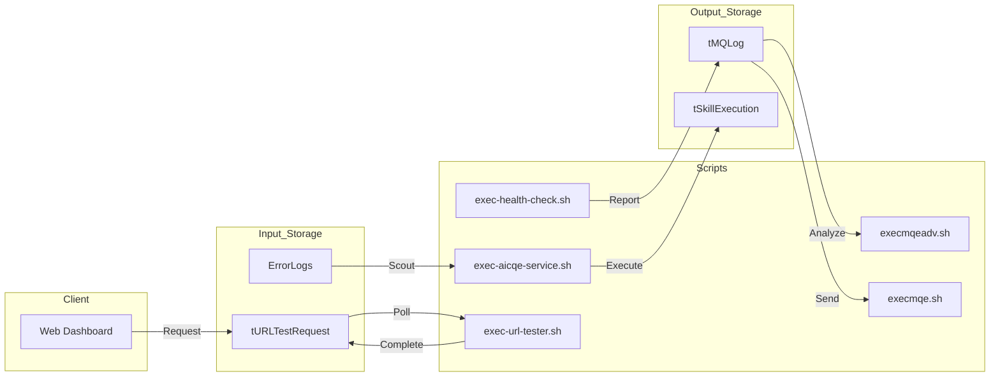

# GIIP Agent for Linux


**Version**: 3.0 (Modular Architecture)

> [!WARNING]
> **Use `giipAgent3.sh` instead of `giipAgent.sh`!**
> `giipAgent.sh` is a legacy single-file version (v1.x) and is **deprecated**. 
> All new features (Gateway Mode, Auto-Discovery, Process List, etc.) are implemented in `giipAgent3.sh` and its `lib/` modules.

## 🌟 개념

GIIP Agent는 서버 모니터링 및 원격 관리 시스템입니다.

**주요 기능:**
- ✅ CQE (Command Queue Execution) - 중앙에서 원격 명령 실행
- ✅ Gateway Mode - 다중 서버 관리 (SSH 기반)
- ✅ Auto-Discovery - 인프라 자동 수집 (OS, 하드웨어, 소프트웨어, 서비스)
- ✅ KVS 로깅 - 모든 실행 이력 자동 기록
- ✅ 5분 주기 하트비트 리포팅

**배포 옵션:**
- **표준 에이전트**: 각 서버에 직접 설치
- **Gateway 에이전트**: 게이트웨이 서버에 설치하여 다중 서버 관리

## 📁 디렉토리 구조

```
giipAgentLinux/
├── 📄 giipAgent3.sh          # 메인 에이전트 (권장)
├── 📄 giipAgent.cnf          # 설정 파일 (템플릿)
├── 📄 README.md              # 이 문서
│
├── 📁 docs/                  # 상세 문서 모음
├── 📁 lib/                   # 핵심 라이브러리 함수
├── 📁 scripts/               # 기본 스크립트 및 운영 관리 스크립트
├── 📁 scripts/               # 유틸리티 스크립트 (진단, 모니터링)
├── 📁 gateway/               # Gateway 모드 관련
├── 📁 cqe/                   # CQE (Command Queue Execution)
├── 📁 admin/                 # 관리자 스크립트 (설치, 등록)
└── 📁 tests/                 # 테스트 스크립트
```

## 🚀 빠른 시작

### 1. 설치

```bash
# 어디든 설치 가능 (예시: /home/shinh/scripts/infraops01/giipAgentLinux)
git clone https://github.com/LowyShin/giipAgentLinux.git /path/to/giipAgentLinux
cd /path/to/giipAgentLinux

# 설정 파일 준비 (레포지토리 부모 디렉토리에 위치해야 함!)
cd ..
cp giipAgentLinux/giipAgent.cnf ./
vi giipAgent.cnf  # sk, lssn 입력
cd giipAgentLinux

# 설치 (현재 디렉토리 기반으로 자동 감지)
sudo ./admin/giipcronreg.sh
```

**⚠️ 중요:** `giipAgent.cnf`는 **giipAgentLinux 레포지토리의 부모 디렉토리**에 위치해야 합니다!

**설정 파일 위치 구조:**
```
/path/to/installation/              ← 설치 위치 (어디든 가능)
├── giipAgent.cnf                   ✅ 설정 파일 (여기!)
└── giipAgentLinux/                 ← 레포지토리 루트
    ├── giipAgent3.sh
    ├── cqe/
    │   └── giipCQE.sh              (../giipAgent.cnf를 찾음)
    └── scripts/
```

- 설치 경로: `/path/to/giipAgentLinux/` (어디든 가능)
- 설정 파일: `/path/to/giipAgent.cnf` (부모 디렉토리) ✅
- 로그: 스크립트별로 `/tmp/` 또는 `/var/log/` 사용

### 2. 설정 확인

```bash
# 설정 파일 확인 (레포지토리 부모 디렉토리에서)
cd /path/to/installation
cat giipAgent.cnf | grep -E "sk=|lssn=|apiaddrv2="

# Cron 등록 확인
crontab -l | grep giip
```

### 3. 배포 모드 선택

**표준 모드** (각 서버에 직접 설치)
```bash
# 설치 디렉토리에서 실행 (위치 무관)
bash giipAgent3.sh

# CQE 테스트 (어디든 설치 가능)
bash cqe/giipCQE.sh --test
```

**Gateway 모드** (다중 서버 관리)
- 설정: [Gateway 빠른 시작](gateway/GATEWAY_QUICKSTART_KR.md)

## 📚 문서 링크

### 📊 서비스 모니터 아키텍처 (Service Monitor Flow)
Service Monitor는 에이전트 스크립트, API, 데이터베이스 간의 유기적 흐름을 시각화합니다. 사용자는 노드 위치를 드래그하여 조정할 수 있으며, **SAVE LAYOUT** 기능을 통해 브라우저에 배치를 영구히 보존할 수 있습니다.



### 🆕 핵심 문서
- **[설정 파일 위치 가이드](../giipdb/docs/GIIP_CONFIG_FILE_LOCATION.md)** - ⭐ giipAgent.cnf 위치 명확화
- **[CQE 명세서](docs/CQE_SPECIFICATION.md)** - 원격 명령 실행 시스템
- **[giipAgent3.sh 명세서](docs/GIIPAGENT3_SPECIFICATION.md)** - 실행 조건, 동작 흐름

### 📋 개념 & 아키텍처
- [모듈식 아키텍처](docs/MODULAR_ARCHITECTURE.md) - v3.0 설계
- [giipAgent3.sh 명세서](docs/GIIPAGENT3_SPECIFICATION.md) - 실행 조건, 동작 흐름
- [SSH 연결 모듈](docs/SSH_CONNECTION_MODULE_GUIDE.md) - SSH 테스트 모듈
- [Auto-Discovery 아키텍처](docs/AUTO_DISCOVERY_ARCHITECTURE.md) - 자동 수집 구조
- [서비스 필터링](docs/SERVICE_PACKAGE_FILTER.md) - 소프트웨어 필터 규칙

### 🚀 기능별 가이드
- **[CQE 명세서](docs/CQE_SPECIFICATION.md)** - 원격 명령 실행 시스템
- **[DPA 통합 가이드](docs/DPA_INTEGRATION_TEST.md)** - 데이터베이스 성능 분석
- **[Utility Scripts 가이드](docs/UTILITY_SCRIPTS_GUIDE.md)** - 진단 및 모니터링 스크립트

### 🏢 Gateway 모드
- **[Gateway 설정 철학](docs/GATEWAY_CONFIG_PHILOSOPHY.md)** - 필독!
- **[Gateway 설정 가이드](docs/GATEWAY_SETUP_GUIDE.md)** - 실제 환경 설정
- [Gateway 빠른 시작](gateway/GATEWAY_QUICKSTART_KR.md) - 한글 가이드
- [Gateway README](gateway/README_GATEWAY.md) - 전체 매뉴얼

### 🔧 운영 & 문제해결
- **[문제 해결 가이드](docs/TROUBLESHOOTING_GUIDE.md)** - 일반 문제 해결
- **[제거 가이드](docs/UNINSTALLATION.md)** - 설치 제거

### 🔗 외부 문서
- [GIIP Dev Agent (Multi-Agent Framework)](https://github.com/LowyShin/giip-dev-agent) - 🤖 자율 멀티 에이전트 프레임워크 (신규!)
- [API 엔드포인트 비교](../giipfaw/docs/API_ENDPOINTS_COMPARISON.md) - giipApi vs giipApiSk vs giipApiSk2
- [Agent 설치 가이드](../giipdb/docs/AGENT_INSTALLATION_GUIDE.md) - 전체 설치 프로세스
- [테스트 서버 설정](../giipdb/docs/TEST_SERVER_INSTALLATION.md) - 테스트 환경
- [보안 체크리스트](../giipdb/docs/SECURITY_CHECKLIST.md) - 보안 점검

## ⚠️ 주의사항

### 설정 파일 위치 (절대 중요!)
- **템플릿**: `giipAgentLinux/giipAgent.cnf` (저장소 내 - 참고용)
- **실제 사용**: 레포지토리 **부모 디렉토리**의 `giipAgent.cnf`
  - 예: `/home/username/scripts/infraops01/giipAgent.cnf`
  - 상대 경로: `${SCRIPT_DIR}/../giipAgent.cnf`

### 프로덕션 문제 해결
```bash
# ❌ 잘못된 위치들 (파일이 없음)
cat ~/giipAgent/giipAgent.cnf                    # 이곳에는 없음!
cat /home/username/giipAgent/giipAgent.cnf      # 이곳에도 없음!

# ✅ 올바른 위치
cd /path/to/installation
cat giipAgent.cnf

# 원격 서버에서 확인
ssh user@server "cd /path/to/installation; cat giipAgent.cnf"
```

### 설정 파일이 없으면
```bash
# 스크립트 실행 시 에러
# ❌ ERROR: Config file not found: ...

# 해결: 부모 디렉토리에 생성
cd /path/to/installation
cat > giipAgent.cnf << 'EOF'
sk="your-secret-key-here"
lssn="0"
giipagentdelay="60"
apiaddrv2="https://giipfaw.azurewebsites.net/api/giipApiSk2"
apiaddrcode="YOUR_FUNCTION_CODE"
EOF
chmod 644 giipAgent.cnf
```

자세한 설정 정보는 **[GIIP_CONFIG_FILE_LOCATION.md](../giipdb/docs/GIIP_CONFIG_FILE_LOCATION.md)** 참조

## 📞 지원

- **GitHub Issues**: https://github.com/LowyShin/giipAgentLinux/issues
- **Email**: support@giip.io
- **Web**: https://giipasp.azurewebsites.net

## 📄 라이선스

인프라 관리 및 모니터링용 무료 사용
