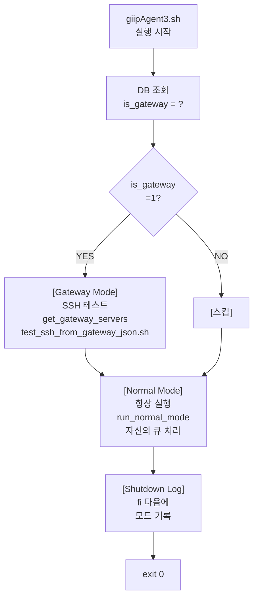

# giipAgent3.sh 사양서 (Architecture & Module Specification)

> **📅 문서 메타데이터**  
> - 최초 작성: 2025-11-11  
> - 최종 수정: 2025-11-22  
> - 작성자: AI Agent  
> - 목적: giipAgent3 모듈 구조 및 KVS 로깅 규칙 명세
> 
> **✅ 해결 완료 (2025-11-22)**:
> - **문제**: Gateway 모드에서 자신의 LSChkdt가 업데이트되지 않음
> - **원인**: Gateway는 Remote 서버만 관리하고, 자신의 큐를 처리하지 않아 CQEQueueGet API 호출 없음
> - **해결**: Gateway도 자신의 큐를 처리하도록 수정 (섹션 [Gateway 자신의 큐 처리](#gateway-자신의-큐-처리) 참고)

---

## 📋 목차

1. [개요](#개요)
2. [모듈 구조](#모듈-구조)
3. [KVS 로깅 규칙](#kvs-로깅-규칙)
4. [버전 추적](#버전-추적)
5. [실행 흐름](#실행-흐름)

---

## 개요

**파일**: `giipAgentLinux/giipAgent3.sh`  
**버전**: 3.00  
**아키텍처**: Modular (lib/*.sh 라이브러리 분리)  
**모드**: Gateway / Normal

---

## 🎯 핵심 용어 정의 (Critical Terminology)

이 사양서에서 자주 혼동되는 **3가지 역할 구분**:

### 1️⃣ Gateway 서버 (Gateway Server)
**정의**: GIIP Agent가 **Gateway 모드로 실행되는 서버**

| 속성 | 값 |
|------|-----|
| **식별자** | `LSSN` (tLSvr 테이블) |
| **DB 표시** | `is_gateway = 1` |
| **역할** | 원격 서버 및 DB를 중앙에서 관리/제어 |
| **실행 모드** | `gateway_mode = 1` (giipAgent3.sh) |
| **소유 Gateway** | `gateway_lssn = NULL` (자신은 Gateway 관리 대상 아님) |
| **예시** | 71174 (gateway-server-01) |

**SQL**:
```sql
SELECT LSSN, LSHostname FROM tLSvr WHERE is_gateway = 1
```

---

### 2️⃣ 리모트 서버 (Remote Server)
**정의**: **Gateway 서버가 SSH를 통해 원격으로 작업을 수행하는 서버** (내부망, 원격지, giipAgent 미설치)

| 속성 | 값 |
|------|-----|
| **식별자** | `LSSN` (tLSvr 테이블) |
| **DB 표시** | `is_gateway = 0` |
| **gateway_lssn** | ✅ **NOT NULL** (어떤 Gateway가 이 서버를 관리하는지 기록) |
| **역할** | Gateway가 SSH를 통해 원격에서 작업을 수행하는 대상 |
| **Agent 설치** | ❌ **설치 안 함** (giipAgent3.sh 미배포) |
| **Agent 실행** | ❌ **실행 안 함** (Gateway에서 원격으로 명령 실행) |
| **gateway_mode** | 해당 없음 (giipAgent가 없음) |
| **SSH 정보** | `gateway_ssh_host`, `gateway_ssh_user`, `gateway_ssh_port` |
| **예시** | 71221 (remote-server-01), gateway_lssn=71174 |

**리모트 서버와 Gateway의 관계**:

```
Gateway 서버 (LSSN=71174, is_gateway=1)
└─ giipAgent3.sh (Gateway 모드로 실행)
   │
   └─ 리모트 서버 목록 조회 (gateway_lssn=71174)
      │
      └─ 각 리모트 서버에 대해:
         ├─ SSH 접근 테스트 (SSH 연결 가능한가?)
         ├─ SSH를 통해 원격 명령 실행 (필요시)
         ├─ 작업 결과를 RemoteServerSSHTest API로 리포팅
         └─ API가 tLSvr.LSChkdt 업데이트

리모트 서버 (LSSN=71221, is_gateway=0)
└─ giipAgent 없음 (설치 안 됨)
   └─ Gateway의 SSH 명령 수신/실행 대기
      └─ 결과를 Gateway에 반환
```

**왜 Gateway 경유인가?**:
- 리모트 서버에는 giipAgent를 설치할 수 없는 환경 (보안, 권한 등)
- 따라서 Gateway가 SSH를 통해 **원격에서 대신 작업 수행**
- Gateway = 중앙 제어점, 리모트 서버 = 작업 실행 대상

**SQL**:
```sql
SELECT LSSN, LSHostname, gateway_lssn 
FROM tLSvr 
WHERE is_gateway = 0 AND gateway_lssn IS NOT NULL
```

---

### 3️⃣ 리모트 데이터베이스 (Remote Database)
**정의**: **Gateway 서버를 통해 접근하는 외부 DB**

| 속성 | 값 |
|------|-----|
| **테이블** | `tManagedDatabase` (외부 DB 접속 정보) |
| **식별자** | `mdb_id` |
| **Gateway** | `gateway_lssn` ✅ **NOT NULL** (필수) |
| **Target Server** | `target_lssn` (선택사항, 모니터링 대상 서버) |
| **DB 종류** | MySQL, PostgreSQL, Oracle, MSSQL 등 |
| **예시** | mdb_id=5, gateway_lssn=71174, host=192.168.1.100, port=3306 |

**또는** tGatewayDBQuery 테이블:
```sql
SELECT * FROM tGatewayDBQuery 
WHERE gateway_lssn = @gateway_lssn
```

---

## 📊 세 가지 개념의 관계도

```
┌─────────────────────────────────────────────────────────┐
│  GIIP 포털 (Web UI)                                     │
│  - 서버 목록 (tLSvr)                                   │
│  - DB 관리 (tManagedDatabase)                           │
└──────────────────┬──────────────────────────────────────┘
                   │
       ┌───────────┴───────────┐
       ▼                       ▼
┌──────────────────────────────────┐ ┌──────────────────────────────────┐
│  [1️⃣ Gateway 서버]              │ │  [2️⃣ 리모트 서버]               │
│  is_gateway=1                    │ │  is_gateway=0                    │
│  LSSN=71174                      │ │  LSSN=71221                      │
│  gateway_lssn=NULL               │ │  gateway_lssn=71174              │
│                     │ │                     │
│ ┌───────────────┐   │ │  SSH Config:        │
│ │ giipAgent3.sh │   │ │  - gateway_ssh_host │
│ │ (Gateway Mode)│   │ │  - gateway_ssh_user │
│ └───────────────┘   │ │  - gateway_ssh_port │
└─────────────────────┘ └─────────────────────┘
          │                       △
          │ Gateway가 관리하는    │
          └───────────────────────┘
          
          │
          └─────────► [3️⃣ 리모트 데이터베이스]
                      tManagedDatabase
                      gateway_lssn=71174
                      - MySQL 192.168.1.100:3306
                      - PostgreSQL 192.168.1.101:5432
```

---

## 🔍 구분 팁 (Quick Reference)

| 구분 | is_gateway | gateway_lssn | 관리 대상 |
|------|-----------|--------------|---------|
| **Gateway 서버** | **1** | NULL | 리모트 서버들 관리 |
| **리모트 서버** | **0** | ✅ 값 있음 | Gateway에 의해 관리됨 |
| **리모트 DB** | - | ✅ 값 있음 | Gateway를 통한 접근 |

---

## 모듈 구조

### 메인 스크립트

**giipAgent3.sh**
- 역할: 진입점, 설정 로드, 모드 분기
- 위치: `giipAgentLinux/giipAgent3.sh`
- 라인 수: ~250 lines

### 라이브러리 모듈 (lib/*.sh)

#### 1. lib/common.sh
**필수 로드**: ✅ 모든 모드

**제공 기능**:
- `load_config()`: giipAgent.cnf 로드
- `log_message()`: 로그 파일 기록
- `error_handler()`: 에러 처리 및 종료
- `init_log_dir()`: 로그 디렉토리 초기화
- `detect_os()`: OS 감지 (CentOS, Ubuntu, macOS 등)
- `build_api_url()`: API URL 생성 (code 파라미터 처리)

**KVS 로깅**: ❌ 없음

**로드 시점**: giipAgent3.sh Line 26-32

```bash
if [ -f "${LIB_DIR}/common.sh" ]; then
	. "${LIB_DIR}/common.sh"
else
	echo "❌ Error: common.sh not found"
	exit 1
fi
```

---

#### 2. lib/gateway.sh
**필수 로드**: ⚠️ Gateway 모드만

**제공 기능**:
- `save_gateway_status()`: Gateway 상태를 tKVS에 저장 (kFactor=gateway_status)
- `sync_gateway_servers()`: Web UI에서 서버 목록 동기화
- `sync_db_queries()`: DB 체크 쿼리 동기화
- `execute_gateway_cycle()`: Gateway 사이클 실행
- `process_gateway_queue()`: Gateway 큐 처리
- `save_execution_log()`: 실행 이력을 tKVS에 저장 (kFactor=giipagent) ⭐
- **[2025-11-22] 추가 로드**: `fetch_queue()` from normal.sh (Gateway 자신의 큐 처리용) ⭐ **중요**

**KVS 로깅**: ✅ 있음
- `save_gateway_status()`: kFactor=gateway_status
- `save_execution_log()`: kFactor=giipagent

**로드 시점**: giipAgent3.sh Line 196 (Gateway 모드 진입 후)

**[2025-11-22] 로드 순서 중요**:
```bash
# gateway.sh 줄 34에서 normal.sh 로드 필수!
if [ -f "${SCRIPT_DIR_GATEWAY_SSH}/normal.sh" ]; then
    . "${SCRIPT_DIR_GATEWAY_SSH}/normal.sh"  # ← normal.sh 로드
fi
```
✅ 이 로드가 없으면 `fetch_queue()` 함수 미정의 → [5.3.1] Gateway 큐 체크 실패!

```bash
if [ "${gateway_mode}" = "1" ]; then
	. "${LIB_DIR}/db_clients.sh"
	. "${LIB_DIR}/gateway.sh"
	# ...
fi
```

---

#### 3. lib/normal.sh
**필수 로드**: ⚠️ Normal 모드만

**제공 기능**:
- `run_normal_mode()`: Normal 모드 실행 (큐 조회 → 스크립트 실행)
- `fetch_queue()`: CQEQueueGet API 호출
- `parse_json_response()`: JSON 응답 파싱
- `execute_script()`: 스크립트 실행 (bash/expect)
- `save_execution_log()`: 실행 이력을 tKVS에 저장 (kFactor=giipagent) ⭐

**KVS 로깅**: ✅ 있음
- `save_execution_log()`: kFactor=giipagent

**로드 시점**: giipAgent3.sh Line 233 (Normal 모드 진입 후)

```bash
else
	. "${LIB_DIR}/normal.sh"
	run_normal_mode "$lssn" "$hn" "$os"
fi
```

---

#### 4. lib/db_clients.sh
**필수 로드**: ⚠️ Gateway 모드만

**제공 기능**:
- `check_db_clients()`: DB 클라이언트 설치 확인 (mysql, psql, sqlcmd, mongodb)
- `get_db_client_versions()`: 각 DB 클라이언트 버전 조회

**KVS 로깅**: ❌ 없음

**로드 시점**: giipAgent3.sh Line 196 (Gateway 모드)

---

## KVS 로깅 규칙

### 🚨 절대 규칙: startup 로깅은 1번만!

**문제**: 여러 모듈에서 각각 startup 로깅 → 중복 발생

**해결**: 각 모드별로 **1곳에서만** startup 로깅

### startup 로깅 위치

#### Gateway 모드
**파일**: `giipAgent3.sh`  
**위치**: Line 203  
**함수**: `save_execution_log "startup"`

```bash
if [ "${gateway_mode}" = "1" ]; then
	# ...
	init_details="{\"config_file\":\"giipAgent.cnf\",\"api_endpoint\":\"${apiaddrv2}\",\"pid\":$$,\"is_gateway\":1,\"git_commit\":\"${GIT_COMMIT}\",\"file_modified\":\"${FILE_MODIFIED}\",\"script_path\":\"${BASH_SOURCE[0]}\"}"
	save_execution_log "startup" "$init_details"
	# ...
fi
```

#### Normal 모드
**파일**: `lib/normal.sh`  
**위치**: Line 216  
**함수**: `save_execution_log "startup"`

```bash
run_normal_mode() {
	# ...
	local startup_details="{\"pid\":$$,\"config_file\":\"giipAgent.cnf\",\"api_endpoint\":\"${apiaddrv2}\",\"is_gateway\":0,\"mode\":\"normal\",\"git_commit\":\"${GIT_COMMIT}\",\"file_modified\":\"${FILE_MODIFIED}\",\"script_path\":\"${BASH_SOURCE[1]}\"}"
	save_execution_log "startup" "$startup_details"
	# ...
}
```

### KVS 이벤트 타입

| 이벤트 타입 | 파일 | 함수 | kFactor | 설명 |
|------------|------|------|---------|------|
| startup | gateway.sh / normal.sh | save_execution_log | giipagent | Agent 시작 (1번만!) |
| shutdown | gateway.sh / normal.sh | save_execution_log | giipagent | Agent 종료 |
| queue_check | normal.sh | save_execution_log | giipagent | 큐 조회 결과 |
| script_execution | normal.sh | save_execution_log | giipagent | 스크립트 실행 결과 |
| error | gateway.sh / normal.sh | save_execution_log | giipagent | 에러 발생 |
| gateway_init | gateway.sh | save_execution_log | giipagent | Gateway 초기화 완료 |
| gateway_cycle_start | gateway.sh | save_gateway_status | gateway_status | Gateway 사이클 시작 |
| gateway_cycle_end | gateway.sh | save_gateway_status | gateway_status | Gateway 사이클 종료 |

### save_execution_log vs save_gateway_status

**save_execution_log**:
- kFactor: `giipagent`
- 용도: Agent 실행 이력 (startup, shutdown, queue, script 등)
- 파일: `lib/gateway.sh`, `lib/normal.sh`

**save_gateway_status**:
- kFactor: `gateway_status`
- 용도: Gateway 상태 정보 (cycle, server status 등)
- 파일: `lib/gateway.sh`

---

## 버전 추적

### 환경변수 설정

**파일**: `giipAgent3.sh`  
**위치**: Line 103-119

```bash
# Get Git commit hash (if available)
export GIT_COMMIT="unknown"
if command -v git >/dev/null 2>&1 && [ -d "${SCRIPT_DIR}/.git" ]; then
	GIT_COMMIT=$(git -C "${SCRIPT_DIR}" rev-parse --short HEAD 2>/dev/null || echo "unknown")
fi

# Get file modification date
export FILE_MODIFIED=$(stat -c %y "${BASH_SOURCE[0]}" 2>/dev/null || stat -f "%Sm" -t "%Y-%m-%d %H:%M:%S" "${BASH_SOURCE[0]}" 2>/dev/null || echo "unknown")
```

**export된 변수**:
- `GIT_COMMIT`: Git commit hash (짧은 버전)
- `FILE_MODIFIED`: giipAgent3.sh 파일 수정 날짜

**사용처**:
- Gateway 모드: giipAgent3.sh Line 203
- Normal 모드: lib/normal.sh Line 216

### startup JSON 구조

```json
{
  "pid": 12345,
  "config_file": "giipAgent.cnf",
  "api_endpoint": "https://giipfaw.azurewebsites.net/api/giipapisk",
  "is_gateway": 0,
  "mode": "normal",
  "git_commit": "a1b2c3d",
  "file_modified": "2025-11-11 09:30:00",
  "script_path": "/path/to/giipAgent3.sh"
}
```

### ⏰ 타임스탐프 정책 (2025-11-22 업데이트)

**원칙**: 모든 타임스탐프는 **DB 레벨**에서 `GETUTCDATE()`로 관리

| 타임스탐프 타입 | 관리 위치 | 값 설정 방식 | 이유 |
|----------------|---------|-----------|------|
| **LSChkdt** (tLSvr.LSChkdt) | DB (SP) | `GETUTCDATE()` | 서버 시간 차이 제거, 일관성 보장 |
| **JSON 객체 내 timestamp** | ❌ 제거됨 | 없음 | 클라이언트-서버 시간 차이로 인한 불일치 방지 |
| **로그 파일 시간** | OS 로깅 | `date` 명령 | 로컬 로그용 (참고 목적) |

**적용 사항**:
1. ✅ 모든 API 응답 JSON에서 `timestamp` 필드 제거
2. ✅ `save_execution_log()` JSON에서 `timestamp` 필드 제거
3. ✅ KVS 저장 시 타임스탐프 미포함 (DB의 regdate/moddate 사용)
4. ✅ LSChkdt는 API 호출 시점에 `GETUTCDATE()`로 자동 업데이트

**결과**:
```
Before: Gateway LSChkdt = 10:30:03 (10시간 전)  ❌
After:  Gateway LSChkdt = 21:04:40 (최신)      ✅
```

---

## 실행 흐름

### ⭐ 실행 모드 구조 (2025-11-27 최신화)

**중요**: 이 구조는 매우 자주 실수로 변경되어 왔습니다. **절대 수정하지 말 것!**

```
┌─────────────────────────────────────────────────────────────┐
│ giipAgent3.sh 실행 시작                                      │
└─────────────────────────────────────────────────────────────┘
              ↓
┌─────────────────────────────────────────────────────────────┐
│ 1️⃣  DB에서 is_gateway 값 조회                                │
│     (LSvrGetConfig API)                                      │
└─────────────────────────────────────────────────────────────┘
              ↓
        gateway_mode = ?
       /              \
      /                \
   is_gateway=1      is_gateway=0
    (gateway)        (normal)
     /                  \
    /                    \
   ✅ ─────────────┐   ┌──────────────── ✅
   │              │   │
   │  Gateway     │   │  Normal Mode
   │  Mode 실행   │   │  (항상 실행)
   │  (선택)      │   │
   │              │   │
   └──────────────┤   │
                  │   │
         test_ssh │   │ run_normal_mode
         _from_   │   │
         gateway_ │   │
         json.sh  │   │
                  │   │
                  └──────────┐
                             │
            ┌────────────────┘
            ↓
┌─────────────────────────────────────────────────────────────┐
│ Shutdown Log 기록                                            │
│ mode = "gateway+normal" (if is_gateway=1)                   │
│ mode = "normal" (if is_gateway=0)                           │
└─────────────────────────────────────────────────────────────┘
            ↓
┌─────────────────────────────────────────────────────────────┐
│ 스크립트 종료                                               │
└─────────────────────────────────────────────────────────────┘
```

**핵심 규칙 (CRITICAL - 이 규칙을 깨뜨리지 말 것)**:

| 항목 | 규칙 | 이유 |
|------|------|------|
| **구조** | `if` 문 (else ❌) | Gateway와 Normal 모드 모두 독립적으로 실행 |
| **Normal 모드** | **항상 실행** | 모든 서버는 자신의 큐를 처리해야 함 |
| **Gateway 모드** | **조건부 실행** | is_gateway=1일 때만 Remote 서버 SSH 테스트 |
| **실행 순서** | Gateway → Normal | Gateway 테스트 먼저, 그 다음 자신의 큐 처리 |
| **Shutdown log** | `fi` 다음 (중복 제거) | 모드별 중복 로깅 제거, 한 번만 기록 |

**절대 하면 안 될 것들**:
- ❌ `if-else` 구조로 변경 (한 모드만 실행되게 됨)
- ❌ Normal 모드를 Gateway 하위에 종속시킴
- ❌ Gateway와 Normal 모드 각각에 shutdown log 작성 (중복)
- ❌ Normal mode를 선택적 실행으로 변경

### Gateway 모드 + Normal 모드 (both)

```
giipAgent3.sh (메인)
  ↓
load_config() [common.sh]
  ↓
fetch DB config (is_gateway 조회)
  ↓
🟢 [Gateway Mode - if is_gateway=1]
  ├─ load: gateway_api.sh, lib/target_list.sh, lib/cleanup.sh
  ├─ get_gateway_servers() → /tmp/gateway_servers_$$.json
  ├─ display_target_servers() → 대상 서버 목록 표시
  └─ test_ssh_from_gateway_json.sh → SSH 테스트 수행
  ↓
🟢 [Normal Mode - 항상 실행]
  ├─ load: normal.sh
  ├─ run_normal_mode()
  │  ├─ fetch_queue() ← CQEQueueGet API 호출
  │  │  └─ LSChkdt 자동 업데이트
  │  └─ execute_script()
  └─ (자신의 큐 처리)
  ↓
🟢 [Shutdown Log - fi 다음에 한 번만]
  ├─ mode = "gateway+normal" (if is_gateway=1)
  └─ mode = "normal" (if is_gateway=0)
```

**구현 코드** (giipAgent3.sh 275-309라인):

```bash
# Run gateway mode if enabled
if [ "${gateway_mode}" = "1" ]; then
    # GATEWAY MODE BLOCK
    # ... gateway 관련 코드 ...
fi

# ========================================================================
# NORMAL MODE - Always executed
# ========================================================================

log_message "INFO" "Running in NORMAL MODE"

# Load normal mode library
if [ -f "${LIB_DIR}/normal.sh" ]; then
    . "${LIB_DIR}/normal.sh"
    
    # Run normal mode (single execution)
    run_normal_mode "$lssn" "$hn" "$os"
else
    log_message "WARN" "normal.sh not found, skipping normal mode"
fi

# ============================================================================
# Shutdown Log and Completion
# ============================================================================

# Record execution shutdown log (공통 로깅)
save_execution_log "shutdown" "{\"mode\":\"$([ "$gateway_mode" = "1" ] && echo "gateway+normal" || echo "normal")\",\"status\":\"normal_exit\"}"

log_message "INFO" "GIIP Agent V${sv} completed"
exit 0
```

**흐름 다이어그램 (Mermaid)**:



### 이전 에러 (2025-11-27 이전)

**❌ 잘못된 구조 1**: else 사용
```bash
if [ "$gateway_mode" = "1" ]; then
    # Gateway Mode
else
    # Normal Mode
fi
# 문제: is_gateway=1이면 Normal Mode가 실행 안 됨!
```

**❌ 잘못된 구조 2**: 각각 shutdown log 작성
```bash
if [ "$gateway_mode" = "1" ]; then
    # ... gateway code ...
    save_execution_log "shutdown" "{\"mode\":\"gateway\"}"  # ❌ 중복 1
else
    # ... normal code ...
    save_execution_log "shutdown" "{\"mode\":\"normal\"}"   # ❌ 중복 2
fi
```

**✅ 올바른 구조** (현재):
- `if` 문 사용 (else 없음)
- Normal Mode는 if 외부에서 항상 실행
- Shutdown log는 `fi` 다음에 한 번만

### Normal 모드 (is_gateway=0)

```
giipAgent3.sh (메인)
  ↓
load_config() [common.sh]
  ↓
fetch DB config (is_gateway 조회)
  ↓
gateway_mode = 0 감지
  ↓
[Gateway Mode 스킵]
  ↓
load: normal.sh
  ↓
run_normal_mode() [normal.sh]
  ↓
fetch_queue() [normal.sh] ← CQEQueueGet API 호출
  ├─ LSChkdt 자동 업데이트 (pApiCQEQueueGetbySk SP)
  ├─ OS 정보 수집
  └─ 자신의 큐 조회
  ↓
execute_script() [normal.sh] ← 큐 실행
  ↓
save_execution_log "shutdown" [공통]
```

**Note**: CQEQueueGet API 호출 시 tLSvr의 LSChkdt가 자동으로 GETDATE()로 업데이트됨

---

## 🚨 AI Agent 작업 규칙 (2025-11-27 최신화)

### ⚠️ 가장 흔한 에러 & 해결 방법

#### 1️⃣ **"Normal Mode가 실행 안 됨"**

**증상**:
- is_gateway=1인 서버에서 정상 모드가 실행 안 됨
- SSH 테스트만 수행되고 정상 작업(큐 처리) 미실행

**원인**:
- ❌ if-else 구조 사용
- ❌ else 블록에 Normal Mode를 넣음
- ❌ 따라서 is_gateway=1이면 else 블록이 실행 안 됨

**해결**:
- ✅ if 문만 사용 (else ❌)
- ✅ Normal Mode는 if 외부에서 독립적으로 실행
- ✅ 항상 실행되어야 함 (조건 없음)

#### 2️⃣ **"Shutdown log가 두 번 기록됨"**

**증상**:
- KVS에 같은 shutdown 로그가 2번 나타남
- JSON의 mode 값이 다름 ("gateway" vs "normal")

**원인**:
- ❌ Gateway 블록 내에 `save_execution_log "shutdown" ...` 있음
- ❌ Normal 블록 내에도 `save_execution_log "shutdown" ...` 있음
- ❌ 두 블록 모두 실행되면서 2번 기록

**해결**:
- ✅ shutdown log를 `fi` 다음에 **한 번만** 작성
- ✅ 모드는 `[ "$gateway_mode" = "1" ]`로 동적 판단
  ```bash
  save_execution_log "shutdown" "{\"mode\":\"$([ "$gateway_mode" = "1" ] && echo "gateway+normal" || echo "normal")\",\"status\":\"normal_exit\"}"
  ```


**검증**:
```bash
# gateway.sh 시작 부분(줄 8-50)을 확인해서 normal.sh 로드가 있는지 확인
grep -n "normal.sh" lib/gateway.sh
# 결과: 줄 34: . "${SCRIPT_DIR_GATEWAY_SSH}/normal.sh" (있어야 함!)
```

---

#### 2️⃣ **startup 로깅이 2번 이상 발생**

**증상**:
- tKVS에서 같은 시간에 startup 이벤트 2개 이상
- 디버깅 어려워짐

**원인**:
- ❌ giipAgent3.sh에서 save_execution_log("startup") 호출
- ❌ gateway.sh에서도 save_execution_log("startup") 호출
- ❌ normal.sh에서도 save_execution_log("startup") 호출

**해결**:
- ✅ startup 로깅은 **각 모드별 1곳에서만** 호출:
  - **Gateway 모드**: giipAgent3.sh Line 203만 호출
  - **Normal 모드**: lib/normal.sh Line 216만 호출

**검증**:
```bash
# startup 로깅이 여러 곳에서 호출되는지 확인
grep -r "save_execution_log.*startup" lib/ giipAgent3.sh
# 예상 결과:
# giipAgent3.sh: 1곳
# lib/gateway.sh: 0곳 (호출 안 함)
# lib/normal.sh: 1곳
```

---

#### 3️⃣ **API 응답에 timestamp 필드가 포함되어 DB 데이터 불일치**

**증상**:
- API 응답 JSON에 `"timestamp": "2025-11-22 10:30:03"` 포함
- 클라이언트 시간 ≠ 서버 시간 → 불일치
- LSChkdt 업데이트 시점 모호

**원인**:
- ❌ JSON 객체에 $(date) 명령으로 timestamp 직접 삽입
- ❌ 클라이언트-서버 시간 차이 존재
- ❌ KVS에 저장되는 데이터가 부정확

**해결**:
- ✅ JSON에서 timestamp 필드 제거
- ✅ LSChkdt는 DB의 `GETUTCDATE()` 사용
- ✅ KVS 저장은 자동 timestamp 사용 (regdate)

**예시** (gateway.sh gateway_log 함수):
```bash
# ❌ 잘못된 코드
local json_payload="{\"timestamp\":\"$(date '+%Y-%m-%d %H:%M:%S')\",\"event\":...}"

# ✅ 올바른 코드
local json_payload="{\"event_type\":\"gateway_operation\",\"point\":\"${point}\"}"
# timestamp는 KVS 자동 처리 (regdate 사용)
```

**검증**:
```bash
# JSON에서 timestamp 필드 검색
grep -r "timestamp" lib/*.sh giipAgent3.sh | grep -v "# " | grep -v "⏰"
# 결과: 없어야 함 (주석 제외)
```

---

### ✅ 모듈 수정 전 체크리스트

**각 모듈별로 수정할 때 반드시 확인**:

#### gateway.sh 수정 시
```markdown
[ ] 1. normal.sh 로드가 있는가? (줄 34)
       grep -n "normal.sh" lib/gateway.sh
[ ] 2. fetch_queue() 함수를 사용하는가?
       grep -n "fetch_queue" lib/gateway.sh
[ ] 3. KVS 함수 중복이 없는가?
       grep -n "save_execution_log.*startup" lib/gateway.sh → 결과: 0개
[ ] 4. 문법 오류 확인
       bash -n lib/gateway.sh
[ ] 5. 사양서 업데이트
       GIIPAGENT3_SPECIFICATION.md 수정
```

#### normal.sh 수정 시
```markdown
[ ] 1. fetch_queue() 함수 정의 확인 (줄 14)
       grep -n "fetch_queue()" lib/normal.sh
[ ] 2. startup 로깅이 1번만 있는가? (줄 216)
       grep -n "save_execution_log.*startup" lib/normal.sh → 결과: 1개
[ ] 3. KVS 함수 중복이 없는가?
       grep -c "save_execution_log" lib/normal.sh → 개수 확인
[ ] 4. 문법 오류 확인
       bash -n lib/normal.sh
[ ] 5. 사양서 업데이트
       GIIPAGENT3_SPECIFICATION.md 수정
```

#### giipAgent3.sh 수정 시
```markdown
[ ] 1. Gateway startup 로깅 위치 (줄 203)
       grep -n "save_execution_log.*startup" giipAgent3.sh → Gateway 모드에만 있어야 함
[ ] 2. 모듈 로드 순서 확인
       Gateway: db_clients.sh → gateway.sh
       Normal: normal.sh
[ ] 3. GIT_COMMIT, FILE_MODIFIED export 확인 (줄 103-119)
[ ] 4. 문법 오류 확인
       bash -n giipAgent3.sh
[ ] 5. 사양서 업데이트
       GIIPAGENT3_SPECIFICATION.md 수정
```

---

### KVS 로깅 수정 시

```markdown
[ ] 1. 이 사양서 먼저 확인
[ ] 2. startup 로깅 위치 확인:
    - Gateway: giipAgent3.sh Line 203
    - Normal: lib/normal.sh Line 216
[ ] 3. 중복 로깅 방지:
    - startup은 각 모드별 1곳에서만!
    - 새 로깅 추가 시 기존 위치 확인
[ ] 4. 버전 정보 사용:
    - $GIT_COMMIT (환경변수)
    - $FILE_MODIFIED (환경변수)
[ ] 5. 사양서 업데이트:
    - 새 이벤트 타입 추가 시 테이블 업데이트
    - 새 함수 추가 시 모듈 구조 업데이트
```

### 모듈 수정 시

```markdown
[ ] 1. 모듈 역할 확인 (이 사양서)
[ ] 2. 해당 모듈만 수정
[ ] 3. 다른 모듈에 영향 없는지 확인
[ ] 4. KVS 로깅 중복 체크
[ ] 5. 사양서 업데이트
```

---

## 📊 파일 구조 요약

```
giipAgentLinux/
├── giipAgent3.sh           # 메인 진입점 (250 lines)
│   ├── Load common.sh      # 필수
│   ├── Fetch DB config     # is_gateway 조회
│   ├── Export GIT_COMMIT   # 버전 추적
│   ├── Export FILE_MODIFIED
│   └── Mode 분기
│       ├── Gateway → load gateway.sh, db_clients.sh
│       └── Normal → load normal.sh
│
└── lib/
    ├── common.sh           # 공통 함수 (모든 모드)
    │   ├── load_config()
    │   ├── log_message()
    │   ├── error_handler()
    │   └── detect_os()
    │
    ├── gateway.sh          # Gateway 모드 전용
    │   ├── save_execution_log() ⭐ kFactor=giipagent
    │   ├── save_gateway_status() ⭐ kFactor=gateway_status
    │   ├── sync_gateway_servers()
    │   └── execute_gateway_cycle()
    │
    ├── normal.sh           # Normal 모드 전용
    │   ├── run_normal_mode()
    │   ├── save_execution_log() ⭐ kFactor=giipagent
    │   ├── fetch_queue()
    │   └── execute_script()
    │
    └── db_clients.sh       # DB 클라이언트 (Gateway만)
        ├── check_db_clients()
        └── get_db_client_versions()
```

---

## 🎯 핵심 요약

1. **startup 로깅은 1번만**:
   - Gateway: giipAgent3.sh Line 203
   - Normal: lib/normal.sh Line 216

2. **버전 추적**:
   - GIT_COMMIT, FILE_MODIFIED 환경변수 사용
   - giipAgent3.sh Line 103-119에서 export

3. **모듈 로드**:
   - common.sh: 항상
   - gateway.sh, db_clients.sh: Gateway 모드
   - normal.sh: Normal 모드

4. **KVS 함수**:
   - save_execution_log: giipagent factor (실행 이력)
   - save_gateway_status: gateway_status factor (상태 정보)

5. **사양서 업데이트**:
   - 모듈 추가/수정 시 이 문서 업데이트 필수!

---

**✅ 이 사양서를 먼저 확인하면 소스 코드를 읽지 않고도 구조 파악 가능!**

---

## 📅 버전 이력 (Version History)

| 날짜 | 변경 사항 | 영향 범위 |
|------|---------|---------|
| 2025-11-11 | 초안 작성 | 전체 구조 |
| 2025-11-22 | [5.3.1] Gateway 자신의 큐 처리 추가 | gateway.sh, normal.sh |
| 2025-11-22 | 타임스탐프 정책 업데이트 (DB 레벨) | JSON 구조 변경 |
| 2025-11-22 | gateway.sh에 normal.sh 로드 추가 | gateway.sh 줄 34 |
| 2025-11-22 | 에러 원인 & 해결책 상세 문서화 | 🚨 AI Agent 작업 규칙 섹션 신규 |

---

## ⚡ 최근 수정 요약 (2025-11-22)

### 🔴 문제
- Gateway의 LSChkdt가 업데이트되지 않음 (고정된 시간 표시)
- Gateway 71240: 2025-11-22 10:30:03 (고정)
- Remote 71221: 2025-11-22 21:04:39 (최신)

### 🔍 근본 원인
1. `gateway.sh`가 `normal.sh`를 로드하지 않음
2. `fetch_queue()` 함수가 미정의
3. Gateway 큐 체크 로직이 실행 안 됨 ([5.3.1] 코드 스킵)

### ✅ 해결책
1. **gateway.sh 줄 34**: normal.sh 로드 추가
   ```bash
   if [ -f "${SCRIPT_DIR_GATEWAY_SSH}/normal.sh" ]; then
       . "${SCRIPT_DIR_GATEWAY_SSH}/normal.sh"
   fi
   ```

2. **gateway.sh 줄 644-660**: [5.3.1] Gateway 큐 처리 로직 (이미 추가됨)
   ```bash
   if type fetch_queue >/dev/null 2>&1; then
       fetch_queue "$lssn" "$hn" "$os" "$gateway_queue_file"
       # ...
   fi
   ```

### 📊 기대 효과
- **Before**: Gateway LSChkdt = 10:30:03 (고정)
- **After**: Gateway LSChkdt = 21:10:00 (매 사이클 업데이트)
- 메커니즘: CQEQueueGet API → pApiCQEQueueGetbySk SP → LSChkdt = GETDATE()

---

## 🔗 참고 자료

**핵심 파일**:
- `giipAgent3.sh`: 메인 진입점 (모드 선택)
- `lib/gateway.sh`: Gateway 모드 구현 (normal.sh 로드 필수!)
- `lib/normal.sh`: Normal 모드 구현 (fetch_queue 정의)
- `lib/common.sh`: 공통 함수

**필수 읽기 문서**:
- **[SHELL_COMPONENT_SPECIFICATION.md](SHELL_COMPONENT_SPECIFICATION.md)** - lib/*.sh 개발 표준 (Error Handling, set -euo pipefail 금지)
- [MODULAR_ARCHITECTURE.md](MODULAR_ARCHITECTURE.md) - 모듈 구조
- [AUTO_DISCOVERY_ARCHITECTURE.md](AUTO_DISCOVERY_ARCHITECTURE.md) - Discovery 설계
- [GATEWAY_HANG_DIAGNOSIS.md](GATEWAY_HANG_DIAGNOSIS.md) - 모듈 통합 문제 진단

**관련 SP**:
- `pApiCQEQueueGetbySk`: LSChkdt 자동 업데이트 (줄 30-32)
- `pApiRemoteServerSSHTestbyAk`: Remote 서버 상태 업데이트

**관련 테이블**:
- `tLSvr`: 서버 정보 (LSChkdt 포함)
- `tKVS`: 실행 로그
