# giipAgent3.sh 사양서 (Architecture & Module Specification)

> **📅 문서 메타데이터**  
> - 최초 작성: 2025-11-11  
> - 최종 수정: 2025-12-04  
> - 작성자: AI Agent  
> - 목적: giipAgent3 모듈 구조, KVS 로깅 규칙, 외부 스크립트 호출 구조 명세
> - **최신 업데이트 (2025-12-04)**: 외부 스크립트 호출 구조 상세화 (섹션 5.3 신규 추가)
> - **이전 업데이트 (2025-11-27)**: 실행 흐름 규칙 확정, 모듈 로드 정보 최신화, 라인 넘버 수정, 새로운 cleanup.sh/target_list.sh 모듈 문서화
> 
> **✅ 해결 완료 (2025-12-04)**:
> - ✅ 외부 스크립트 호출 계층도 추가 (giipAgent3.sh → scripts/ → gateway/)
> - ✅ 각 스크립트의 역할 및 호출 흐름 명확화
> - ✅ 파일별 역할 및 라이브러리 로드 순서 명문화
> - ✅ 각 스크립트의 상세 호출 흐름 문서화
> 
> **✅ 해결 완료 (2025-11-27)**:
> - ✅ Gateway와 Normal 모드 독립 실행 (if, 절대 if-else 금지)
> - ✅ Shutdown log 단일화 (fi 블록 다음에 한 번만 기록)
> - ✅ 모듈 통합 (cleanup.sh, target_list.sh, gateway_api.sh 활용)
> - ✅ 실행 흐름 규칙 명문화 및 AI Agent 작업 규칙 문서화

---

## 🚨 필수 읽기 순서 (Before Reading This Document)

**이 문서를 읽기 전에 꼭 먼저 읽어야 할 문서**:

| 문서 | 설명 | 필독 사유 |
|------|------|---------|
| **⚠️ [SHELL_COMPONENT_SPECIFICATION.md](./SHELL_COMPONENT_SPECIFICATION.md)** | lib/*.sh 개발 표준 (Error Handling, set -euo pipefail 금지) | giipAgent3 모든 모듈의 개발 규칙 정의 |
| **[CQE_SPECIFICATION.md](./CQE_SPECIFICATION.md)** | CQE (Centralized Queue Engine) - queue_get 함수 명세 | Normal 모드에서 queue_get 함수 사용 시 이해 필수 |
| **[MODULAR_ARCHITECTURE.md](./MODULAR_ARCHITECTURE.md)** | 모듈 구조 개요 및 분리 전략 | 라이브러리 모듈들의 역할 분담 이해 |

**선택 사항 (필요시 읽기)**:
- [AUTO_DISCOVERY_ARCHITECTURE.md](./AUTO_DISCOVERY_ARCHITECTURE.md) - Discovery 설계
- [GATEWAY_HANG_DIAGNOSIS.md](./GATEWAY_HANG_DIAGNOSIS.md) - 모듈 통합 문제 진단
- [GATEWAY_SETUP_GUIDE.md](./GATEWAY_SETUP_GUIDE.md) - Gateway 실제 환경 설정

---

## 📋 목차

1. [개요](#개요)
2. [모듈 구조](#모듈-구조)
3. [KVS 로깅 규칙](#kvs-로깅-규칙)
4. [버전 추적](#버전-추적)
5. [실행 흐름](#실행-흐름)
   - [5.1 실행 모드 구조](#-실행-모드-구조-2025-11-27-최신화)
   - [5.2 Gateway + Normal 모드](#gateway-모드--normal-모드-both)
   - [5.3 외부 스크립트 호출 구조 (NEW 2025-12-04)](#-외부-스크립트-호출-구조-2025-12-04-신규)
6. [변경 이력](#-최근-수정-요약-2025-11-22)

---

## 개요

**파일**: `giipAgentLinux/giipAgent3.sh`  
**버전**: 3.00  
**라인 수**: 306 lines (2025-11-27 최신)  
**아키텍처**: Modular (lib/*.sh 라이브러리 분리 + cleanup/target_list 통합)  
**모드**: Gateway + Normal (병행 실행)

---

## 🎯 핵심 용어 정의 (Critical Terminology)

이 사양서에서 자주 혼동되는 **3가지 역할 구분**:

### 1️⃣ Gateway 서버 (Gateway Server)
**정의**: GIIP Agent가 **Gateway 모드로 실행되는 서버**

| 속성 | 값 |
|------|-----|
| **식별자** | `LSSN` (tLSvr 테이블) |
| **DB 표시** | `is_gateway = 1` |
| **역할** | 원격 서버 및 DB를 중앙에서 관리/제어 |
| **실행 모드** | `gateway_mode = 1` (giipAgent3.sh) |
| **소유 Gateway** | `gateway_lssn = NULL` (자신은 Gateway 관리 대상 아님) |
| **예시** | 71174 (gateway-server-01) |

**SQL**:
```sql
SELECT LSSN, LSHostname FROM tLSvr WHERE is_gateway = 1
```

---

### 2️⃣ 리모트 서버 (Remote Server)
**정의**: **Gateway 서버가 SSH를 통해 원격으로 작업을 수행하는 서버** (내부망, 원격지, giipAgent 미설치)

| 속성 | 값 |
|------|-----|
| **식별자** | `LSSN` (tLSvr 테이블) |
| **DB 표시** | `is_gateway = 0` |
| **gateway_lssn** | ✅ **NOT NULL** (어떤 Gateway가 이 서버를 관리하는지 기록) |
| **역할** | Gateway가 SSH를 통해 원격에서 작업을 수행하는 대상 |
| **Agent 설치** | ❌ **설치 안 함** (giipAgent3.sh 미배포) |
| **Agent 실행** | ❌ **실행 안 함** (Gateway에서 원격으로 명령 실행) |
| **gateway_mode** | 해당 없음 (giipAgent가 없음) |
| **SSH 정보** | `gateway_ssh_host`, `gateway_ssh_user`, `gateway_ssh_port` |
| **예시** | 71221 (remote-server-01), gateway_lssn=71174 |

**리모트 서버와 Gateway의 관계**:

```
Gateway 서버 (LSSN=71174, is_gateway=1)
└─ giipAgent3.sh (Gateway 모드로 실행)
   │
   └─ 리모트 서버 목록 조회 (gateway_lssn=71174)
      │
      └─ 각 리모트 서버에 대해:
         ├─ SSH 접근 테스트 (SSH 연결 가능한가?)
         ├─ SSH를 통해 원격 명령 실행 (필요시)
         ├─ 작업 결과를 RemoteServerSSHTest API로 리포팅
         └─ API가 tLSvr.LSChkdt 업데이트

리모트 서버 (LSSN=71221, is_gateway=0)
└─ giipAgent 없음 (설치 안 됨)
   └─ Gateway의 SSH 명령 수신/실행 대기
      └─ 결과를 Gateway에 반환
```

**왜 Gateway 경유인가?**:
- 리모트 서버에는 giipAgent를 설치할 수 없는 환경 (보안, 권한 등)
- 따라서 Gateway가 SSH를 통해 **원격에서 대신 작업 수행**
- Gateway = 중앙 제어점, 리모트 서버 = 작업 실행 대상

**SQL**:
```sql
SELECT LSSN, LSHostname, gateway_lssn 
FROM tLSvr 
WHERE is_gateway = 0 AND gateway_lssn IS NOT NULL
```

---

### 3️⃣ 리모트 데이터베이스 (Remote Database)
**정의**: **Gateway 서버를 통해 접근하는 외부 DB**

| 속성 | 값 |
|------|-----|
| **테이블** | `tManagedDatabase` (외부 DB 접속 정보) |
| **식별자** | `mdb_id` |
| **Gateway** | `gateway_lssn` ✅ **NOT NULL** (필수) |
| **Target Server** | `target_lssn` (선택사항, 모니터링 대상 서버) |
| **DB 종류** | MySQL, PostgreSQL, Oracle, MSSQL 등 |
| **예시** | mdb_id=5, gateway_lssn=71174, host=192.168.1.100, port=3306 |

**또는** tGatewayDBQuery 테이블:
```sql
SELECT * FROM tGatewayDBQuery 
WHERE gateway_lssn = @gateway_lssn
```

---

## 📊 세 가지 개념의 관계도

```
┌─────────────────────────────────────────────────────────┐
│  GIIP 포털 (Web UI)                                     │
│  - 서버 목록 (tLSvr)                                   │
│  - DB 관리 (tManagedDatabase)                           │
└──────────────────┬──────────────────────────────────────┘
                   │
       ┌───────────┴───────────┐
       ▼                       ▼
┌──────────────────────────────────┐ ┌──────────────────────────────────┐
│  [1️⃣ Gateway 서버]              │ │  [2️⃣ 리모트 서버]               │
│  is_gateway=1                    │ │  is_gateway=0                    │
│  LSSN=71174                      │ │  LSSN=71221                      │
│  gateway_lssn=NULL               │ │  gateway_lssn=71174              │
│                     │ │                     │
│ ┌───────────────┐   │ │  SSH Config:        │
│ │ giipAgent3.sh │   │ │  - gateway_ssh_host │
│ │ (Gateway Mode)│   │ │  - gateway_ssh_user │
│ └───────────────┘   │ │  - gateway_ssh_port │
└─────────────────────┘ └─────────────────────┘
          │                       △
          │ Gateway가 관리하는    │
          └───────────────────────┘
          
          │
          └─────────► [3️⃣ 리모트 데이터베이스]
                      tManagedDatabase
                      gateway_lssn=71174
                      - MySQL 192.168.1.100:3306
                      - PostgreSQL 192.168.1.101:5432
```

---

## 🔍 구분 팁 (Quick Reference)

| 구분 | is_gateway | gateway_lssn | 관리 대상 |
|------|-----------|--------------|---------|
| **Gateway 서버** | **1** | NULL | 리모트 서버들 관리 |
| **리모트 서버** | **0** | ✅ 값 있음 | Gateway에 의해 관리됨 |
| **리모트 DB** | - | ✅ 값 있음 | Gateway를 통한 접근 |

---

## 모듈 구조

### 메인 스크립트

**giipAgent3.sh**
- 역할: 진입점, 설정 로드, 모드 분기, cleanup 통합
- 위치: `giipAgentLinux/giipAgent3.sh`
- 라인 수: 306 lines (2025-11-27)
- 핵심 변경: cleanup.sh/target_list.sh/kvs.sh 통합 로드, 실행 흐름 재구성

### 라이브러리 모듈 (lib/*.sh)

#### 0. lib/kvs.sh (NEW - 2025-11-27)
**필수 로드**: ✅ 모든 모드

**제공 기능**:
- `kvs_put()`: KVS 키-값 저장 (디버깅용 메타데이터)
- `save_execution_log()`: 실행 이력을 tKVS에 저장 (kFactor=giipagent) ⭐ **중요**
- `save_gateway_status()`: Gateway 상태 저장 (kFactor=gateway_status)

**KVS 로깅**: ✅ 있음
- kFactor=giipagent (실행 이력)
- kFactor=gateway_status (Gateway 상태)

**로드 시점**: giipAgent3.sh Line 39-44

```bash
if [ -f "${LIB_DIR}/kvs.sh" ]; then
	. "${LIB_DIR}/kvs.sh"
else
	echo "❌ Error: kvs.sh not found"
	exit 1
fi
```

**역할**: 모든 KVS 로깅의 중앙 집중식 처리

---

#### 1. lib/common.sh
**필수 로드**: ✅ 모든 모드

**제공 기능**:
- `load_config()`: giipAgent.cnf 로드
- `log_message()`: 로그 파일 기록
- `error_handler()`: 에러 처리 및 종료
- `init_log_dir()`: 로그 디렉토리 초기화
- `detect_os()`: OS 감지 (CentOS, Ubuntu, macOS 등)
- `build_api_url()`: API URL 생성 (code 파라미터 처리)

**KVS 로깅**: ❌ 없음

**로드 시점**: giipAgent3.sh Line 28-33 (맨 먼저)

```bash
if [ -f "${LIB_DIR}/common.sh" ]; then
	. "${LIB_DIR}/common.sh"
else
	echo "❌ Error: common.sh not found in ${LIB_DIR}"
	exit 1
fi
```

---

#### 2. lib/gateway.sh
**필수 로드**: ⚠️ Gateway 모드만

**제공 기능**:
- `save_gateway_status()`: Gateway 상태를 tKVS에 저장 (kFactor=gateway_status)
- `sync_gateway_servers()`: Web UI에서 서버 목록 동기화
- `sync_db_queries()`: DB 체크 쿼리 동기화
- `execute_gateway_cycle()`: Gateway 사이클 실행
- `process_gateway_queue()`: Gateway 큐 처리
- `save_execution_log()`: 실행 이력을 tKVS에 저장 (kFactor=giipagent) ⭐
- **[2025-11-22] 추가 로드**: `fetch_queue()` from normal.sh (Gateway 자신의 큐 처리용) ⭐ **중요**

**KVS 로깅**: ✅ 있음
- `save_gateway_status()`: kFactor=gateway_status
- `save_execution_log()`: kFactor=giipagent

**로드 시점**: giipAgent3.sh Line 196 (Gateway 모드 진입 후)

**[2025-11-22] 로드 순서 중요**:
```bash
# gateway.sh 줄 34에서 normal.sh 로드 필수!
if [ -f "${SCRIPT_DIR_GATEWAY_SSH}/normal.sh" ]; then
    . "${SCRIPT_DIR_GATEWAY_SSH}/normal.sh"  # ← normal.sh 로드
fi
```
✅ 이 로드가 없으면 `fetch_queue()` 함수 미정의 → [5.3.1] Gateway 큐 체크 실패!

```bash
if [ "${gateway_mode}" = "1" ]; then
	. "${LIB_DIR}/db_clients.sh"
	. "${LIB_DIR}/gateway.sh"
	# ...
fi
```

---

#### 3. lib/normal.sh
**필수 로드**: ⚠️ Normal 모드만

**제공 기능**:
- `run_normal_mode()`: Normal 모드 실행 (큐 조회 → 스크립트 실행)
- `fetch_queue()`: CQEQueueGet API 호출
- `parse_json_response()`: JSON 응답 파싱
- `execute_script()`: 스크립트 실행 (bash/expect)
- `save_execution_log()`: 실행 이력을 tKVS에 저장 (kFactor=giipagent) ⭐

**KVS 로깅**: ✅ 있음
- `save_execution_log()`: kFactor=giipagent

**로드 시점**: giipAgent3.sh Line 233 (Normal 모드 진입 후)

```bash
else
	. "${LIB_DIR}/normal.sh"
	run_normal_mode "$lssn" "$hn" "$os"
fi
```

---

#### 5. lib/cleanup.sh (NEW - 2025-11-27)
**필수 로드**: ✅ 모든 모드 (초기화 단계)

**제공 기능**:
- `cleanup_old_temp_files(pattern)`: 패턴에 맞는 오래된 파일 삭제
- `cleanup_all_temp_files()`: 모든 GIIP 임시 파일 정리

**KVS 로깅**: ❌ 없음 (정리 목적)

**로드 시점**: giipAgent3.sh Line 46-50 (config 로드 전)

```bash
if [ -f "${LIB_DIR}/cleanup.sh" ]; then
	. "${LIB_DIR}/cleanup.sh"
else
	echo "❌ Error: cleanup.sh not found"
	exit 1
fi
```

**실행 시점**: giipAgent3.sh Line 68-70 (config 로드 후 즉시)

```bash
cleanup_all_temp_files
echo ""
```

**정리 대상**:
- `/tmp/giip_discovery_*.json`
- `/tmp/gateway_servers_*.json`
- `/tmp/ssh_test_logs/`

---

#### 6. lib/target_list.sh (NEW - 2025-11-27)
**필수 로드**: ⚠️ Gateway 모드 (SSH 테스트 전)

**제공 기능**:
- `display_target_servers(json_file)`: 대상 서버 목록 색상 출력
- `print_info/success/error/warning()`: ANSI 색상 함수

**KVS 로깅**: ❌ 없음 (표시 목적)

**로드 시점**: giipAgent3.sh Line 52-57 (항상, 사용 시에만 호출)

```bash
if [ -f "${LIB_DIR}/target_list.sh" ]; then
	. "${LIB_DIR}/target_list.sh"
else
	echo "❌ Error: target_list.sh not found"
	exit 1
fi
```

**역할**: Gateway 모드에서 `display_target_servers()` 함수 제공

---

#### 7. lib/gateway_api.sh (외부 모듈)
**필수 로드**: ⚠️ Gateway 모드만 (SSH 테스트 수행)

**제공 기능**:
- `get_gateway_servers()`: Gateway가 관리하는 Remote 서버 목록 조회 및 JSON 저장
- `gateway_api_*`: 기타 Gateway API 함수들

**KVS 로깅**: ❌ 없음 (API 호출만)

**로드 시점**: giipAgent3.sh Line 195-198 (Gateway 모드 진입 시)

```bash
if [ -f "${LIB_DIR}/gateway_api.sh" ]; then
	. "${LIB_DIR}/gateway_api.sh"
else
	log_message "ERROR" "gateway_api.sh not found"
	exit 1
fi
```

---

#### 8. lib/db_clients.sh
**필수 로드**: ⚠️ Gateway 모드만

**제공 기능**:
- `check_db_clients()`: DB 클라이언트 설치 확인 (mysql, psql, sqlcmd, mongodb)
- `get_db_client_versions()`: 각 DB 클라이언트 버전 조회

**KVS 로깅**: ❌ 없음

**로드 시점**: giipAgent3.sh Line 199 (Gateway 모드, gateway_api.sh 전)

---

## KVS 로깅 규칙

### 🚨 절대 규칙: startup 로깅은 1번만!

**문제**: 여러 모듈에서 각각 startup 로깅 → 중복 발생

**해결**: 각 모드별로 **1곳에서만** startup 로깅

### startup 로깅 위치

#### Gateway 모드
**파일**: `giipAgent3.sh`  
**위치**: 현재 코드에서 startup 로깅 없음 (gateway.sh에서 수행 또는 normal.sh 이용)
**함수**: `save_execution_log "startup"`

**주의**: 현재 giipAgent3.sh는 startup 로깅을 하지 않고, 각 모드가 자체 startup을 기록합니다.

```bash
if [ "${gateway_mode}" = "1" ]; then
	# ...
	init_details="{\"config_file\":\"giipAgent.cnf\",\"api_endpoint\":\"${apiaddrv2}\",\"pid\":$$,\"is_gateway\":1,\"git_commit\":\"${GIT_COMMIT}\",\"file_modified\":\"${FILE_MODIFIED}\",\"script_path\":\"${BASH_SOURCE[0]}\"}"
	save_execution_log "startup" "$init_details"
	# ...
fi
```

#### Normal 모드
**파일**: `lib/normal.sh`  
**위치**: Line 216  
**함수**: `save_execution_log "startup"`

```bash
run_normal_mode() {
	# ...
	local startup_details="{\"pid\":$$,\"config_file\":\"giipAgent.cnf\",\"api_endpoint\":\"${apiaddrv2}\",\"is_gateway\":0,\"mode\":\"normal\",\"git_commit\":\"${GIT_COMMIT}\",\"file_modified\":\"${FILE_MODIFIED}\",\"script_path\":\"${BASH_SOURCE[1]}\"}"
	save_execution_log "startup" "$startup_details"
	# ...
}
```

### KVS 이벤트 타입

| 이벤트 타입 | 파일 | 함수 | kFactor | 설명 |
|------------|------|------|---------|------|
| startup | gateway.sh / normal.sh | save_execution_log | giipagent | Agent 시작 (1번만!) |
| shutdown | gateway.sh / normal.sh | save_execution_log | giipagent | Agent 종료 |
| queue_check | normal.sh | save_execution_log | giipagent | 큐 조회 결과 |
| script_execution | normal.sh | save_execution_log | giipagent | 스크립트 실행 결과 |
| error | gateway.sh / normal.sh | save_execution_log | giipagent | 에러 발생 |
| gateway_init | gateway.sh | save_execution_log | giipagent | Gateway 초기화 완료 |
| gateway_cycle_start | gateway.sh | save_gateway_status | gateway_status | Gateway 사이클 시작 |
| gateway_cycle_end | gateway.sh | save_gateway_status | gateway_status | Gateway 사이클 종료 |

### save_execution_log vs save_gateway_status

**save_execution_log**:
- kFactor: `giipagent`
- 용도: Agent 실행 이력 (startup, shutdown, queue, script 등)
- 파일: `lib/gateway.sh`, `lib/normal.sh`

**save_gateway_status**:
- kFactor: `gateway_status`
- 용도: Gateway 상태 정보 (cycle, server status 등)
- 파일: `lib/gateway.sh`

---

## 버전 추적

### 환경변수 설정

**파일**: `giipAgent3.sh`  
**위치**: Line 149-156 (초기화 후, config 로드 전)

```bash
# Get Git commit hash (if available)
export GIT_COMMIT="unknown"
if command -v git >/dev/null 2>&1 && [ -d "${SCRIPT_DIR}/.git" ]; then
	GIT_COMMIT=$(git -C "${SCRIPT_DIR}" rev-parse --short HEAD 2>/dev/null || echo "unknown")
fi

# Get file modification date
export FILE_MODIFIED=$(stat -c %y "${BASH_SOURCE[0]}" 2>/dev/null || stat -f "%Sm" -t "%Y-%m-%d %H:%M:%S" "${BASH_SOURCE[0]}" 2>/dev/null || echo "unknown")
```

**export된 변수**:
- `GIT_COMMIT`: Git commit hash (짧은 버전)
- `FILE_MODIFIED`: giipAgent3.sh 파일 수정 날짜

**사용처**:
- Gateway 모드: giipAgent3.sh Line 203
- Normal 모드: lib/normal.sh Line 216

### startup JSON 구조

```json
{
  "pid": 12345,
  "config_file": "giipAgent.cnf",
  "api_endpoint": "https://giipfaw.azurewebsites.net/api/giipapisk",
  "is_gateway": 0,
  "mode": "normal",
  "git_commit": "a1b2c3d",
  "file_modified": "2025-11-11 09:30:00",
  "script_path": "/path/to/giipAgent3.sh"
}
```

### ⏰ 타임스탐프 정책 (2025-11-22 업데이트)

**원칙**: 모든 타임스탐프는 **DB 레벨**에서 `GETUTCDATE()`로 관리

| 타임스탐프 타입 | 관리 위치 | 값 설정 방식 | 이유 |
|----------------|---------|-----------|------|
| **LSChkdt** (tLSvr.LSChkdt) | DB (SP) | `GETUTCDATE()` | 서버 시간 차이 제거, 일관성 보장 |
| **JSON 객체 내 timestamp** | ❌ 제거됨 | 없음 | 클라이언트-서버 시간 차이로 인한 불일치 방지 |
| **로그 파일 시간** | OS 로깅 | `date` 명령 | 로컬 로그용 (참고 목적) |

**적용 사항**:
1. ✅ 모든 API 응답 JSON에서 `timestamp` 필드 제거
2. ✅ `save_execution_log()` JSON에서 `timestamp` 필드 제거
3. ✅ KVS 저장 시 타임스탐프 미포함 (DB의 regdate/moddate 사용)
4. ✅ LSChkdt는 API 호출 시점에 `GETUTCDATE()`로 자동 업데이트

**결과**:
```
Before: Gateway LSChkdt = 10:30:03 (10시간 전)  ❌
After:  Gateway LSChkdt = 21:04:40 (최신)      ✅
```

---

## 실행 흐름

### ⭐ 실행 모드 구조 (2025-11-27 최신화)

**중요**: 이 구조는 매우 자주 실수로 변경되어 왔습니다. **절대 수정하지 말 것!**

```
┌─────────────────────────────────────────────────────────────┐
│ giipAgent3.sh 실행 시작                                      │
└─────────────────────────────────────────────────────────────┘
              ↓
┌─────────────────────────────────────────────────────────────┐
│ 1️⃣  DB에서 is_gateway 값 조회                                │
│     (LSvrGetConfig API)                                      │
└─────────────────────────────────────────────────────────────┘
              ↓
        gateway_mode = ?
       /              \
      /                \
   is_gateway=1      is_gateway=0
    (gateway)        (normal)
     /                  \
    /                    \
   ✅ ─────────────┐   ┌──────────────── ✅
   │              │   │
   │  Gateway     │   │  Normal Mode
   │  Mode 실행   │   │  (항상 실행)
   │  (선택)      │   │
   │              │   │
   └──────────────┤   │
                  │   │
         test_ssh │   │ run_normal_mode
         _from_   │   │
         gateway_ │   │
         json.sh  │   │
                  │   │
                  └──────────┐
                             │
            ┌────────────────┘
            ↓
┌─────────────────────────────────────────────────────────────┐
│ Shutdown Log 기록                                            │
│ mode = "gateway+normal" (if is_gateway=1)                   │
│ mode = "normal" (if is_gateway=0)                           │
└─────────────────────────────────────────────────────────────┘
            ↓
┌─────────────────────────────────────────────────────────────┐
│ 스크립트 종료                                               │
└─────────────────────────────────────────────────────────────┘
```

**핵심 규칙 (CRITICAL - 이 규칙을 깨뜨리지 말 것)**:

| 항목 | 규칙 | 이유 |
|------|------|------|
| **구조** | `if` 문 (else ❌) | Gateway와 Normal 모드 모두 독립적으로 실행 |
| **Normal 모드** | **항상 실행** | 모든 서버는 자신의 큐를 처리해야 함 |
| **Gateway 모드** | **조건부 실행** | is_gateway=1일 때만 Remote 서버 SSH 테스트 |
| **실행 순서** | Gateway → Normal | Gateway 테스트 먼저, 그 다음 자신의 큐 처리 |
| **Shutdown log** | `fi` 다음 (중복 제거) | 모드별 중복 로깅 제거, 한 번만 기록 |

**절대 하면 안 될 것들**:
- ❌ `if-else` 구조로 변경 (한 모드만 실행되게 됨)
- ❌ Normal 모드를 Gateway 하위에 종속시킴
- ❌ Gateway와 Normal 모드 각각에 shutdown log 작성 (중복)
- ❌ Normal mode를 선택적 실행으로 변경

### Gateway 모드 + Normal 모드 (both)

```
giipAgent3.sh (메인)
  ↓
load_config() [common.sh]
  ↓
fetch DB config (is_gateway 조회)
  ↓
🟢 [Gateway Mode - if is_gateway=1]
  ├─ load: gateway_api.sh, lib/target_list.sh, lib/cleanup.sh
  ├─ get_gateway_servers() → /tmp/gateway_servers_$$.json
  ├─ display_target_servers() → 대상 서버 목록 표시
  └─ gateway/ssh_test.sh → SSH 테스트 수행
  ↓
🟢 [Normal Mode - 항상 실행]
  ├─ load: normal.sh
  ├─ run_normal_mode()
  │  ├─ fetch_queue() ← CQEQueueGet API 호출
  │  │  └─ LSChkdt 자동 업데이트
  │  └─ execute_script()
  └─ (자신의 큐 처리)
  ↓
🟢 [Shutdown Log - fi 다음에 한 번만]
  ├─ mode = "gateway+normal" (if is_gateway=1)
  └─ mode = "normal" (if is_gateway=0)
```

**구현 코드** (giipAgent3.sh 275-309라인):

```bash
# Run gateway mode if enabled
if [ "${gateway_mode}" = "1" ]; then
    # GATEWAY MODE BLOCK
    # ... gateway 관련 코드 ...
fi

# ========================================================================
# NORMAL MODE - Always executed
# ========================================================================

log_message "INFO" "Running in NORMAL MODE"

# Load normal mode library
if [ -f "${LIB_DIR}/normal.sh" ]; then
    . "${LIB_DIR}/normal.sh"
    
    # Run normal mode (single execution)
    run_normal_mode "$lssn" "$hn" "$os"
else
    log_message "WARN" "normal.sh not found, skipping normal mode"
fi

# ============================================================================
# Shutdown Log and Completion
# ============================================================================

# Record execution shutdown log (공통 로깅)
save_execution_log "shutdown" "{\"mode\":\"$([ "$gateway_mode" = "1" ] && echo "gateway+normal" || echo "normal")\",\"status\":\"normal_exit\"}"

log_message "INFO" "GIIP Agent V${sv} completed"
exit 0
```

**흐름 다이어그램 (Mermaid)**:

```mermaid
graph TD
    A["giipAgent3.sh<br/>실행 시작"] --> B["DB 조회<br/>is_gateway = ?"]
    B --> C{"is_gateway<br/>=1?"}
    C -->|YES| D["[Gateway Mode]<br/>SSH 테스트<br/>get_gateway_servers<br/>gateway/ssh_test.sh"]
    C -->|NO| E["[스킵]"]
    D --> F["[Normal Mode]<br/>항상 실행<br/>run_normal_mode<br/>자신의 큐 처리"]
    E --> F
    F --> G["[Shutdown Log]<br/>fi 다음에<br/>모드 기록"]
    G --> H["exit 0"]
```



### 이전 에러 (2025-11-27 이전)

**❌ 잘못된 구조 1**: else 사용
```bash
if [ "$gateway_mode" = "1" ]; then
    # Gateway Mode
else
    # Normal Mode
fi
# 문제: is_gateway=1이면 Normal Mode가 실행 안 됨!
```

**❌ 잘못된 구조 2**: 각각 shutdown log 작성
```bash
if [ "$gateway_mode" = "1" ]; then
    # ... gateway code ...
    save_execution_log "shutdown" "{\"mode\":\"gateway\"}"  # ❌ 중복 1
else
    # ... normal code ...
    save_execution_log "shutdown" "{\"mode\":\"normal\"}"   # ❌ 중복 2
fi
```

**✅ 올바른 구조** (현재):
- `if` 문 사용 (else 없음)
- Normal Mode는 if 외부에서 항상 실행
- Shutdown log는 `fi` 다음에 한 번만

### Normal 모드 (is_gateway=0)

```
giipAgent3.sh (메인)
  ↓
load_config() [common.sh]
  ↓
fetch DB config (is_gateway 조회)
  ↓
gateway_mode = 0 감지
  ↓
[Gateway Mode 스킵]
  ↓
load: normal.sh
  ↓
run_normal_mode() [normal.sh]
  ↓
fetch_queue() [normal.sh] ← CQEQueueGet API 호출
  ├─ LSChkdt 자동 업데이트 (pApiCQEQueueGetbySk SP)
  ├─ OS 정보 수집
  └─ 자신의 큐 조회
  ↓
execute_script() [normal.sh] ← 큐 실행
  ↓
save_execution_log "shutdown" [공통]
```

**Note**: CQEQueueGet API 호출 시 tLSvr의 LSChkdt가 자동으로 GETDATE()로 업데이트됨

---

## 🎯 외부 스크립트 호출 구조 (2025-12-04 신규)

### 호출 계층도 (Refactored to Orchestrator Pattern)

```
giipAgent3.sh (메인 진입점)
│
├─ [if is_gateway=1] Gateway 모드
│  │
│  └─ scripts/gateway_mode.sh (오케스트레이터)
│     │
│     ├─ scripts/gateway-fetch-servers.sh (Step 1)
│     │  │
│     │  ├─ lib/common.sh (로드)
│     │  ├─ lib/kvs.sh (로드)
│     │  ├─ lib/gateway_api.sh (로드)
│     │  │
│     │  ├─ get_gateway_servers() [gateway_api.sh]
│     │  │  └─ API: GatewayRemoteServerListForAgent
│     │  │     결과: /tmp/gateway_servers_$$.json
│     │  │
│     │  └─ KVS 로깅: gateway_fetch_servers_success/failed
│     │
│     └─ scripts/gateway-ssh-test.sh (Step 2)
│        │
│        ├─ lib/common.sh (로드)
│        ├─ lib/kvs.sh (로드)
│        │
│        ├─ gateway/ssh_test.sh (bash 호출)
│        │  │
│        │  ├─ lib/common.sh (로드)
│        │  ├─ lib/kvs.sh (로드)
│        │  ├─ lib/target_list.sh (로드)
│        │  ├─ lib/cqe.sh (로드)
│        │  │
│        │  ├─ JSON 파싱 (jq or grep)
│        │  ├─ SSH 테스트 수행
│        │  │  ├─ Key 인증 시도
│        │  │  ├─ Password 인증 시도 (sshpass)
│        │  │  └─ 기본 SSH 키 시도
│        │  │
│        │  ├─ 각 리모트 서버별:
│        │  │  ├─ OS 정보 감지
│        │  │  ├─ KVS 로깅
│        │  │  └─ queue_get() 호출 [cqe.sh]
│        │  │
│        │  └─ 리포트 생성 (텍스트/JSON)
│        │
│        └─ KVS 로깅: gateway_ssh_test_success/warning
│
└─ [항상 실행] Normal 모드
   │
   └─ scripts/normal_mode.sh
      │
      ├─ lib/common.sh (로드)
      ├─ lib/kvs.sh (로드)
      ├─ lib/normal.sh (로드)
      │
      ├─ run_normal_mode()
      │  │
      │  ├─ fetch_queue() [normal.sh]
      │  │  └─ API: CQEQueueGetbySk
      │  │
      │  └─ execute_script() [normal.sh]
      │
      └─ (정상 또는 오류로 종료)
   
└─ [공통] Shutdown 로깅
   └─ save_execution_log("shutdown")
```

### 파일별 역할 및 특징

| 파일 | 호출자 | 용도 | 독립 실행 | 핵심 로직 |
|------|--------|------|---------|---------|
| **gateway_mode.sh** | giipAgent3.sh | 오케스트레이터 | ✅ 가능 | Step 1, 2 조율 |
| **gateway-fetch-servers.sh** | gateway_mode.sh | 서버 목록 조회 | ✅ 가능 | API 호출, JSON 생성 |
| **gateway-ssh-test.sh** | gateway_mode.sh | SSH 테스트 관리 | ✅ 가능 | gateway/ssh_test.sh 호출 |
| **gateway/ssh_test.sh** | gateway-ssh-test.sh | SSH 테스트 실행 | ✅ 가능 | 각 서버별 테스트 |

### 호출 특징

#### 1️⃣ 각 스크립트는 완전히 독립적

```bash
# 각각 독립적으로 실행 가능
bash scripts/gateway-fetch-servers.sh /path/to/config
bash scripts/gateway-ssh-test.sh /path/to/config
bash scripts/gateway_mode.sh /path/to/config
```

#### 2️⃣ 오케스트레이터 패턴

gateway_mode.sh는 다음 순서로 실행:
1. **Step 1**: `bash scripts/gateway-fetch-servers.sh` 호출
   - 성공: 다음 단계로 진행
   - 실패: 종료 (치명적 오류)

2. **Step 2**: `bash scripts/gateway-ssh-test.sh` 호출
   - 성공/실패: 로그 기록 후 종료 (계속 진행)

3. **Shutdown**: 최종 로그 기록

#### 3️⃣ 라이브러리 로드 순서

각 스크립트에서:
```bash
. "${LIB_DIR}/common.sh"       # 먼저: 기본 함수
. "${LIB_DIR}/kvs.sh"         # 그 다음: KVS 로깅
. "${LIB_DIR}/gateway_api.sh" # 그 다음: 필요시 로드
```

### 로깅 포인트

#### gateway_mode.sh
- `[3.0]` Gateway Mode 시작
- `[3.1]` 설정 로드 완료

#### gateway-fetch-servers.sh
- `[4.1]` 리모트 서버 목록 조회 시작
- `[4.2]` 리모트 서버 목록 조회 성공
- `[4.3]` 리모트 서버 목록 조회 실패

#### gateway-ssh-test.sh
- `[5.1]` SSH 테스트 시작
- `[5.2]` SSH 테스트 성공
- `[5.3]` SSH 테스트 실패/경고

### 호출 흐름 상세 (각 스크립트)

#### gateway_mode.sh의 호출 흐름

```
gateway_mode.sh 시작
  ↓
Config 로드 및 검증
  ↓
외부 스크립트 존재 여부 확인
  ├─ gateway-fetch-servers.sh 확인
  └─ gateway-ssh-test.sh 확인
  ↓
Step 1: bash scripts/gateway-fetch-servers.sh
  ├─ 성공 (exit 0) → 다음 단계
  └─ 실패 (exit 1) → 종료
  ↓
Step 2: bash scripts/gateway-ssh-test.sh
  ├─ 성공 (exit 0) → shutdown 로그
  └─ 경고 (exit 1) → shutdown 로그 (계속)
  ↓
Shutdown 로그 기록
  ↓
종료
```

#### gateway-fetch-servers.sh의 호출 흐름

```
gateway-fetch-servers.sh 시작
  ↓
Config 로드
  ↓
Library 로드: common.sh, kvs.sh, gateway_api.sh
  ↓
get_gateway_servers() 호출 [gateway_api.sh]
  ├─ API 호출: GatewayRemoteServerListForAgent
  ├─ /tmp/gateway_servers_$$.json 생성
  └─ 파일 경로 stdout에 출력
  ↓
성공/실패 판정
  ├─ 성공: KVS 로깅 후 exit 0
  └─ 실패: KVS 로깅 후 exit 1
  ↓
종료
```

#### gateway-ssh-test.sh의 호출 흐름

```
gateway-ssh-test.sh 시작
  ↓
Config 로드
  ↓
Library 로드: common.sh, kvs.sh
  ↓
전제 조건 검증
  ├─ gateway/ssh_test.sh 존재 확인
  └─ /tmp/gateway_servers_*.json 존재 확인
  ↓
bash gateway/ssh_test.sh 호출
  ├─ ssh_test.sh가 JSON 자동 감지
  ├─ 각 서버별 SSH 테스트 수행
  ├─ 결과를 KVS에 로깅
  └─ 리포트 생성
  ↓
결과 처리
  ├─ exit 0: 성공 → KVS 로깅 후 exit 0
  └─ exit N: 경고 → KVS 로깅 후 exit 0 (계속)
  ↓
종료
```

### 장점

✅ **모듈화**: 각 기능이 독립적 파일로 분리
✅ **테스트 용이**: 각 스크립트를 독립적으로 테스트 가능
✅ **유지보수**: 한 스크립트 수정이 다른 곳 영향 최소
✅ **재사용성**: 각 스크립트를 다른 곳에서 호출 가능
✅ **오류 추적**: 각 단계의 exit code 명확
✅ **로깅**: 로깅 포인트 체계적 구성

---

## 🚨 AI Agent 작업 규칙 (2025-11-27 최신화)

### ⚠️ 가장 흔한 에러 & 해결 방법

#### 1️⃣ **"Normal Mode가 실행 안 됨"**

**증상**:
- is_gateway=1인 서버에서 정상 모드가 실행 안 됨
- SSH 테스트만 수행되고 정상 작업(큐 처리) 미실행

**원인**:
- ❌ if-else 구조 사용
- ❌ else 블록에 Normal Mode를 넣음
- ❌ 따라서 is_gateway=1이면 else 블록이 실행 안 됨

**해결**:
- ✅ if 문만 사용 (else ❌)
- ✅ Normal Mode는 if 외부에서 독립적으로 실행
- ✅ 항상 실행되어야 함 (조건 없음)

#### 2️⃣ **"Shutdown log가 두 번 기록됨"**

**증상**:
- KVS에 같은 shutdown 로그가 2번 나타남
- JSON의 mode 값이 다름 ("gateway" vs "normal")

**원인**:
- ❌ Gateway 블록 내에 `save_execution_log "shutdown" ...` 있음
- ❌ Normal 블록 내에도 `save_execution_log "shutdown" ...` 있음
- ❌ 두 블록 모두 실행되면서 2번 기록

**해결**:
- ✅ shutdown log를 `fi` 다음에 **한 번만** 작성
- ✅ 모드는 `[ "$gateway_mode" = "1" ]`로 동적 판단
  ```bash
  save_execution_log "shutdown" "{\"mode\":\"$([ "$gateway_mode" = "1" ] && echo "gateway+normal" || echo "normal")\",\"status\":\"normal_exit\"}"
  ```


**검증**:
```bash
# gateway.sh 시작 부분(줄 8-50)을 확인해서 normal.sh 로드가 있는지 확인
grep -n "normal.sh" lib/gateway.sh
# 결과: 줄 34: . "${SCRIPT_DIR_GATEWAY_SSH}/normal.sh" (있어야 함!)
```

---

#### 2️⃣ **startup 로깅이 2번 이상 발생**

**증상**:
- tKVS에서 같은 시간에 startup 이벤트 2개 이상
- 디버깅 어려워짐

**원인**:
- ❌ giipAgent3.sh에서 save_execution_log("startup") 호출
- ❌ gateway.sh에서도 save_execution_log("startup") 호출
- ❌ normal.sh에서도 save_execution_log("startup") 호출

**해결**:
- ✅ startup 로깅은 **각 모드별 1곳에서만** 호출:
  - **Gateway 모드**: giipAgent3.sh Line 203만 호출
  - **Normal 모드**: lib/normal.sh Line 216만 호출

**검증**:
```bash
# startup 로깅이 여러 곳에서 호출되는지 확인
grep -r "save_execution_log.*startup" lib/ giipAgent3.sh
# 예상 결과:
# giipAgent3.sh: 1곳
# lib/gateway.sh: 0곳 (호출 안 함)
# lib/normal.sh: 1곳
```

---

#### 3️⃣ **API 응답에 timestamp 필드가 포함되어 DB 데이터 불일치**

**증상**:
- API 응답 JSON에 `"timestamp": "2025-11-22 10:30:03"` 포함
- 클라이언트 시간 ≠ 서버 시간 → 불일치
- LSChkdt 업데이트 시점 모호

**원인**:
- ❌ JSON 객체에 $(date) 명령으로 timestamp 직접 삽입
- ❌ 클라이언트-서버 시간 차이 존재
- ❌ KVS에 저장되는 데이터가 부정확

**해결**:
- ✅ JSON에서 timestamp 필드 제거
- ✅ LSChkdt는 DB의 `GETUTCDATE()` 사용
- ✅ KVS 저장은 자동 timestamp 사용 (regdate)

**예시** (gateway.sh gateway_log 함수):
```bash
# ❌ 잘못된 코드
local json_payload="{\"timestamp\":\"$(date '+%Y-%m-%d %H:%M:%S')\",\"event\":...}"

# ✅ 올바른 코드
local json_payload="{\"event_type\":\"gateway_operation\",\"point\":\"${point}\"}"
# timestamp는 KVS 자동 처리 (regdate 사용)
```

**검증**:
```bash
# JSON에서 timestamp 필드 검색
grep -r "timestamp" lib/*.sh giipAgent3.sh | grep -v "# " | grep -v "⏰"
# 결과: 없어야 함 (주석 제외)
```

---

### ⚠️ 절대 규칙: bash 독립 호출 (2025-11-28 신규)

**모든 모듈은 bash로 독립적으로 호출되어야 함** (실행 권한 부여 금지)

#### 올바른 호출 방식

```bash
# ✅ 올바른 방식: bash로 직접 실행
if [ -f "$script_file" ]; then
    bash "$script_file"  # 실행 권한 필수 X
else
    log_message "ERROR" "Script not found"
    exit 1
fi
```

#### 절대 하면 안 될 것

```bash
# ❌ 잘못된 방식 1: chmod로 실행 권한 부여
chmod +x "$script_file"  # 금지!
"$script_file"  # 직접 실행 금지!

# ❌ 잘못된 방식 2: 파일 실행 권한 확인
if [ ! -x "$script_file" ]; then
    chmod +x "$script_file"  # 금지!
fi
```

#### 적용 범위

| 모듈 | 호출 방식 | 위치 |
|------|---------|------|
| **gateway/ssh_test.sh** | `bash "${SCRIPT_DIR}/gateway/ssh_test.sh"` | giipAgent3.sh Line 279 |
| **lib/gateway.sh** | `. "${LIB_DIR}/gateway.sh"` | giipAgent3.sh (load) |
| **lib/normal.sh** | `. "${LIB_DIR}/normal.sh"` | giipAgent3.sh (load) |
| 기타 스크립트 | `bash "$script_path"` | 모두 동일 |

**이유**: 파일 시스템 권한이 불일치할 수 있으므로, bash 인터프리터로 실행하여 독립적 실행 보장

---

### ✅ 모듈 수정 전 체크리스트

**각 모듈별로 수정할 때 반드시 확인**:

#### 모든 모듈 공통
```markdown
[ ] 1. ⚠️ bash 독립 호출 확인
       - 호출: bash "$script_file"
       - 금지: chmod +x / 직접 실행
[ ] 2. 파일 존재 여부 확인
       if [ ! -f "$script_file" ]; then ... fi
[ ] 3. 에러 처리 추가
       if bash "$script_file"; then ... else ... fi
[ ] 4. 문법 오류 확인
       bash -n $script_file
[ ] 5. 사양서 업데이트
       GIIPAGENT3_SPECIFICATION.md 수정
```

#### gateway.sh 수정 시
```markdown
[ ] 1. normal.sh 로드가 있는가? (줄 34)
       grep -n "normal.sh" lib/gateway.sh
[ ] 2. fetch_queue() 함수를 사용하는가?
       grep -n "fetch_queue" lib/gateway.sh
[ ] 3. KVS 함수 중복이 없는가?
       grep -n "save_execution_log.*startup" lib/gateway.sh → 결과: 0개
[ ] 4. 문법 오류 확인
       bash -n lib/gateway.sh
[ ] 5. 사양서 업데이트
       GIIPAGENT3_SPECIFICATION.md 수정
```

#### normal.sh 수정 시
```markdown
[ ] 1. fetch_queue() 함수 정의 확인 (줄 14)
       grep -n "fetch_queue()" lib/normal.sh
[ ] 2. startup 로깅이 1번만 있는가? (줄 216)
       grep -n "save_execution_log.*startup" lib/normal.sh → 결과: 1개
[ ] 3. KVS 함수 중복이 없는가?
       grep -c "save_execution_log" lib/normal.sh → 개수 확인
[ ] 4. 문법 오류 확인
       bash -n lib/normal.sh
[ ] 5. 사양서 업데이트
       GIIPAGENT3_SPECIFICATION.md 수정
```

#### giipAgent3.sh 수정 시
```markdown
[ ] 1. Gateway startup 로깅 위치 (줄 203)
       grep -n "save_execution_log.*startup" giipAgent3.sh → Gateway 모드에만 있어야 함
[ ] 2. 모듈 로드 순서 확인
       Gateway: db_clients.sh → gateway.sh
       Normal: normal.sh
[ ] 3. GIT_COMMIT, FILE_MODIFIED export 확인 (줄 103-119)
[ ] 4. 문법 오류 확인
       bash -n giipAgent3.sh
[ ] 5. 사양서 업데이트
       GIIPAGENT3_SPECIFICATION.md 수정
```

---

### KVS 로깅 수정 시

```markdown
[ ] 1. 이 사양서 먼저 확인
[ ] 2. startup 로깅 위치 확인:
    - Gateway: giipAgent3.sh Line 203
    - Normal: lib/normal.sh Line 216
[ ] 3. 중복 로깅 방지:
    - startup은 각 모드별 1곳에서만!
    - 새 로깅 추가 시 기존 위치 확인
[ ] 4. 버전 정보 사용:
    - $GIT_COMMIT (환경변수)
    - $FILE_MODIFIED (환경변수)
[ ] 5. 사양서 업데이트:
    - 새 이벤트 타입 추가 시 테이블 업데이트
    - 새 함수 추가 시 모듈 구조 업데이트
```

### 모듈 수정 시

```markdown
[ ] 1. 모듈 역할 확인 (이 사양서)
[ ] 2. 해당 모듈만 수정
[ ] 3. 다른 모듈에 영향 없는지 확인
[ ] 4. KVS 로깅 중복 체크
[ ] 5. 사양서 업데이트
```

---

## 📊 파일 구조 요약

```
giipAgentLinux/
├── giipAgent3.sh           # 메인 진입점 (306 lines, 2025-11-27)
│   ├── Load common.sh      # Line 28-33 (필수)
│   ├── Load kvs.sh         # Line 39-44 (필수, KVS 로깅)
│   ├── Load cleanup.sh     # Line 46-50 (필수, 임시 파일 정리)
│   ├── Load target_list.sh # Line 52-57 (필수, 표시 함수)
│   ├── Fetch DB config     # Line 75-165 (is_gateway 조회)
│   ├── Init Logging        # Line 168-176
│   ├── Export GIT_COMMIT   # Line 149-156 (버전 추적)
│   ├── Export FILE_MODIFIED
│   ├── Cleanup old files   # Line 68-70
│   └── Mode 분기
│       ├── Gateway (if) → Line 180-209
│       │   ├── Load gateway_api.sh
│       │   ├── Get server list
│       │   └── SSH test
│       └── Normal (항상) → Line 211-223
│           ├── Load normal.sh
│           └── run_normal_mode()
│
└── lib/
    ├── common.sh           # 공통 함수 (모든 모드)
    │   ├── load_config()
    │   ├── log_message()
    │   ├── error_handler()
    │   └── detect_os()
    │
    ├── gateway.sh          # Gateway 모드 전용
    │   ├── save_execution_log() ⭐ kFactor=giipagent
    │   ├── save_gateway_status() ⭐ kFactor=gateway_status
    │   ├── sync_gateway_servers()
    │   └── execute_gateway_cycle()
    │
    ├── normal.sh           # Normal 모드 전용
    │   ├── run_normal_mode()
    │   ├── save_execution_log() ⭐ kFactor=giipagent
    │   ├── fetch_queue()
    │   └── execute_script()
    │
    └── db_clients.sh       # DB 클라이언트 (Gateway만)
        ├── check_db_clients()
        └── get_db_client_versions()
```

---

## 🎯 핵심 요약 (2025-11-27 최신)

### ⭐ 실행 흐름 (절대 변경 금지)

```
Load Modules (kvs, cleanup, target_list) → DB Config → Cleanup
→ [if gateway_mode=1] → Gateway (SSH test) → [endif]
→ [ALWAYS] → Normal (queue process)
→ Shutdown Log (fi 다음에 한 번만!)
```

### 핵심 규칙

1. **모듈 로드 순서**:
   - common.sh (Line 28-33) ← 맨 먼저!
   - kvs.sh (Line 39-44) ← KVS 로깅
   - cleanup.sh (Line 46-50) ← 정리
   - target_list.sh (Line 52-57) ← 표시
   - (config 로드 후)
   - gateway_api.sh: Gateway 모드에서만
   - normal.sh: Normal 모드에서만

2. **버전 추적**:
   - GIT_COMMIT, FILE_MODIFIED 환경변수
   - giipAgent3.sh Line 149-156에서 export

3. **실행 모드 (절대 if-else 금지!)**:
   - Gateway: `if [ "$gateway_mode" = "1" ]` (조건부)
   - Normal: `if` 바깥 (항상 실행)
   - Shutdown: `fi` 다음 (공통 한 번만)

4. **startup 로깅**:
   - Gateway 모드: gateway.sh에서 자체 처리
   - Normal 모드: normal.sh에서 자체 처리
   - 각 모드별 1번씩만!

5. **KVS 로깅 (중복 금지!)**:
   - save_execution_log(): kFactor=giipagent (실행 이력)
   - save_gateway_status(): kFactor=gateway_status (Gateway 상태)
   - 각 위치에서 1번씩만

6. **사양서 업데이트**:
   - 모듈 추가/수정 시 이 문서 업데이트 필수!
   - 라인 넘버, 함수명, 로드 조건 정확히
   - AI Agent 작업 규칙 섹션 참고

---

**✅ 이 사양서를 먼저 확인하면 소스 코드를 읽지 않고도 구조 파악 가능!**

---

## 📅 버전 이력 (Version History)

| 날짜 | 변경 사항 | 영향 범위 | 파일 |
|------|---------|----------|------|
| 2025-11-11 | 초안 작성 | 전체 구조 | GIIPAGENT3_SPECIFICATION.md |
| 2025-11-22 | [5.3.1] Gateway 자신의 큐 처리 추가 | gateway.sh, normal.sh | lib/gateway.sh |
| 2025-11-22 | 타임스탐프 정책 업데이트 (DB 레벨) | JSON 구조 변경 | 명세서 |
| 2025-11-22 | gateway.sh에 normal.sh 로드 추가 | gateway.sh 줄 34 | lib/gateway.sh |
| 2025-11-22 | 에러 원인 & 해결책 상세 문서화 | 🚨 AI Agent 작업 규칙 섹션 신규 | 명세서 |
| 2025-11-27 | **giipAgent3.sh 실행 흐름 확정** | **코드 구조화** | **giipAgent3.sh (306 lines)** |
| 2025-11-27 | 모듈 통합: kvs.sh, cleanup.sh, target_list.sh | **모듈 로드 정보** | giipAgent3.sh, 명세서 |
| 2025-11-27 | Gateway와 Normal 모드 독립 실행 규칙 | **if 구조 확정** | 명세서 섹션 5 |
| 2025-11-27 | **사양서 전체 최신화** | **라인 넘버 정정** | GIIPAGENT3_SPECIFICATION.md |
| 2025-12-04 | **외부 스크립트 호출 구조 상세화** | **섹션 5.3 신규 추가** | **GIIPAGENT3_SPECIFICATION.md** |
| 2025-12-04 | 호출 계층도 (giipAgent3.sh → scripts/ → gateway/) | **파일별 역할 명확화** | 명세서 |
| 2025-12-04 | WORK_PROMPT_CHECKLIST에 GIIPAGENT3_SPECIFICATION 링크 추가 | **AI 작업 체크리스트** | WORK_PROMPT_CHECKLIST.md |

---

## ⚡ 최근 수정 요약 (2025-11-22)

### 🔴 문제
- Gateway의 LSChkdt가 업데이트되지 않음 (고정된 시간 표시)
- Gateway 71240: 2025-11-22 10:30:03 (고정)
- Remote 71221: 2025-11-22 21:04:39 (최신)

### 🔍 근본 원인
1. `gateway.sh`가 `normal.sh`를 로드하지 않음
2. `fetch_queue()` 함수가 미정의
3. Gateway 큐 체크 로직이 실행 안 됨 ([5.3.1] 코드 스킵)

### ✅ 해결책
1. **gateway.sh 줄 34**: normal.sh 로드 추가
   ```bash
   if [ -f "${SCRIPT_DIR_GATEWAY_SSH}/normal.sh" ]; then
       . "${SCRIPT_DIR_GATEWAY_SSH}/normal.sh"
   fi
   ```

2. **gateway.sh 줄 644-660**: [5.3.1] Gateway 큐 처리 로직 (이미 추가됨)
   ```bash
   if type fetch_queue >/dev/null 2>&1; then
       fetch_queue "$lssn" "$hn" "$os" "$gateway_queue_file"
       # ...
   fi
   ```

### 📊 기대 효과
- **Before**: Gateway LSChkdt = 10:30:03 (고정)
- **After**: Gateway LSChkdt = 21:10:00 (매 사이클 업데이트)
- 메커니즘: CQEQueueGet API → pApiCQEQueueGetbySk SP → LSChkdt = GETDATE()

---

## 🔗 참고 자료

**핵심 파일**:
- `giipAgent3.sh`: 메인 진입점 (모드 선택)
- `lib/gateway.sh`: Gateway 모드 구현 (normal.sh 로드 필수!)
- `lib/normal.sh`: Normal 모드 구현 (fetch_queue 정의)
- `lib/common.sh`: 공통 함수

**필수 읽기 문서**:
- **[SHELL_COMPONENT_SPECIFICATION.md](SHELL_COMPONENT_SPECIFICATION.md)** - lib/*.sh 개발 표준 (Error Handling, set -euo pipefail 금지)
- [MODULAR_ARCHITECTURE.md](MODULAR_ARCHITECTURE.md) - 모듈 구조
- [AUTO_DISCOVERY_ARCHITECTURE.md](AUTO_DISCOVERY_ARCHITECTURE.md) - Discovery 설계
- [GATEWAY_HANG_DIAGNOSIS.md](GATEWAY_HANG_DIAGNOSIS.md) - 모듈 통합 문제 진단

**관련 SP**:
- `pApiCQEQueueGetbySk`: LSChkdt 자동 업데이트 (줄 30-32)
- `pApiRemoteServerSSHTestbyAk`: Remote 서버 상태 업데이트

**관련 테이블**:
- `tLSvr`: 서버 정보 (LSChkdt 포함)
- `tKVS`: 실행 로그
